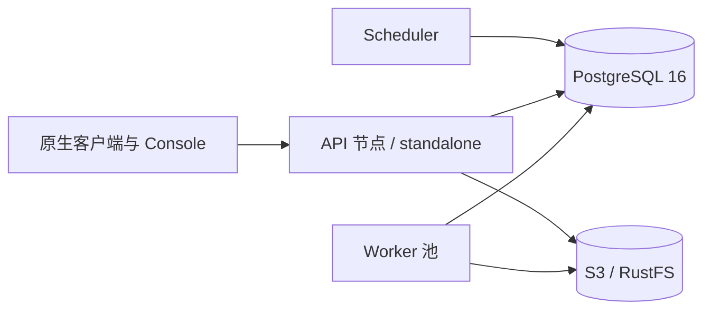

# Artifact Gateway 架构

[English](ARCHITECTURE.md)

Artifact Gateway 是面向 OCI、Raw、Maven、Conan 2、npm、PyPI、Go modules 和 APT 的
制品库。前六种格式具备完整 Hosted 生命周期；Go 同时提供标准 Proxy/Group 读取、原子
Hosted 发布，以及感知格式的墓碑/恢复、保留、晋升和复制。APT 公开声明的仍只有
Proxy/Group；显式创建的 Hosted 预览仓库可以通过管理接口暂存软件包并原子发布签名
Suite。该预览已经包含 loopback 参考签名器、固定公钥轮换和真实 Debian 客户端门禁，
但生产密钥托管、恢复、告警和运维证据完成前，APT Hosted 不作为公开能力。

系统将持久元数据、不可变制品字节、协议处理与后台生命周期任务分离，因此同一个
Gateway 二进制既可以紧凑单机运行，也可以按角色拆分为集群节点。

## 系统上下文

PostgreSQL 是仓库、授权、制品元数据、生命周期状态、审计、幂等和后台租约的事实来源。
S3/RustFS 按摘要保存经过校验的对象字节；Gateway 进程不会在本地磁盘保留持久制品状态。

单机、角色拆分、发布和 Worker 流程详见[架构图](docs/architecture-diagrams.zh-CN.md)；
协调与搜索所使用的数据库能力详见[PostgreSQL 能力](docs/postgresql-capabilities.zh-CN.md)。

## 运行角色

一个镜像通过 `GATEWAY_NODE_ROLES` 支持四种运行配置：

| 角色 | 职责 | 对外接口 |
| --- | --- | --- |
| `api` | 原生协议、公开浏览、管理接口 | 完整 HTTP 接口 |
| `scheduler` | 发现并入队周期性生命周期任务 | 仅运维接口 |
| `worker` | 租用并执行持久后台任务 | 仅运维接口 |
| `standalone` | 在一个进程中运行 API、Scheduler 和 Worker | 完整 HTTP 接口 |

Worker 可以按制品格式和任务类型约束。节点通过 PostgreSQL 租约、fencing token、幂等键、
advisory lock、`FOR UPDATE SKIP LOCKED` 和尽力而为的 `LISTEN/NOTIFY` 唤醒协作。通知从来
不是事实来源；即使通知丢失，轮询仍会恢复任务。

`internal/lifecycle.Runtime` 负责已经迁移的生命周期 Worker 所共享的领取、租约心跳、
终态、指标、轮询和通知语义；领域 Worker 只保留任务自身实现。迁移采用增量方式，确保
每一步都维持既有持久任务契约和恢复行为。

部署约束和拓扑示例见[分布式部署](docs/distributed-deployment.md)。

## 主要代码职责

| 路径 | 职责 |
| --- | --- |
| `cmd/gateway` | 进程组合、运行角色、生命周期启停 |
| `internal/app` | HTTP 组合与应用用例 |
| `internal/authorization` | 认证与授权策略 |
| `internal/protocol` | 原生包协议解析与 wire compatibility |
| `internal/repository` | 领域记录及内存/PostgreSQL 持久化 |
| `internal/objectstore` | 内容寻址对象存储 |
| `internal/lifecycle` | 持久任务状态与共享生命周期语义 |
| `internal/replication` | 带检查点的跨仓库复制 |
| `internal/maintenance` | 保留、回收、缓存与删除任务 |
| `internal/admin/openapi` | 生成的管理接口服务端契约 |
| `api/openapi` | 可编辑接口契约源及打包产物 |
| `console` | React 与 Ant Design 管理/公开 Console |

协议包负责 wire compatibility 和格式坐标；应用 Handler 负责授权并编排领域接口，不应
重新实现协议规则。Repository 实现负责事务持久化，但不负责 HTTP 响应语义。

## 仓库模型

- **Hosted** 接受原生发布并拥有制品生命周期。
- **Proxy** 从获准上游读取并执行缓存策略。
- **Group** 在一个客户端入口后，按顺序解析 Hosted 与 Proxy 成员。

发布必须先校验字节，再让元数据可见。仓库删除是逻辑且异步的：进入 `deleting` 后立即
停止协议访问，Worker 再将仓库推进到 `deleted`，元数据继续作为审计锚点保留。生命周期
契约允许的格式支持制品墓碑恢复。

晋升记录不可变源快照并复用已经校验的内容寻址字节，它不会把快照版本重命名成正式
版本。复制独立维护持久字节传输、检查点和完整性校验。

规范性生命周期决策记录在 `docs/adr/` 与
[制品生命周期契约](docs/artifact-lifecycle-contract.zh-CN.md)中。

## 接口契约归属

`api/openapi/native-hosted.yaml` 及其同级 YAML 是可编辑契约。打包 JSON、
`console/src/client` 下的 Console 客户端和 `internal/admin/openapi` 下的 Go 服务端契约
统一生成。

所有管理接口演进都必须通过 `make openapi-check` 与接口兼容性检查。生成文件需要提交，
以便评审者看到契约变更对客户端和服务端的精确影响。

## 一致性与故障模型

- PostgreSQL 事务定义元数据可见性和状态迁移。
- 对象字节可能先于发布事务存在；回收任务只会在宽限期结束并重新检查引用后删除孤儿字节。
- 后台任务采用 at-least-once；租约 token 会隔离过期 Worker，Handler 必须保持幂等。
- S3 兼容存储与 PostgreSQL 是共享集群依赖，Worker 不能依赖其他节点的内存或文件系统。
- Readiness 检查当前角色所需依赖，liveness 只报告进程健康。

## 变更规则

1. 在对应领域或协议职责内增加行为，不直接堆入无关 HTTP Handler。
2. Schema 变更只能通过前向迁移。
3. 保持已发布坐标和内容摘要不可变。
4. 重试必须幂等，并隔离租约已经过期的 Worker 写入。
5. 外部接口先修改 OpenAPI。
6. 数据库锁与对象存储行为必须由集成测试证明。
