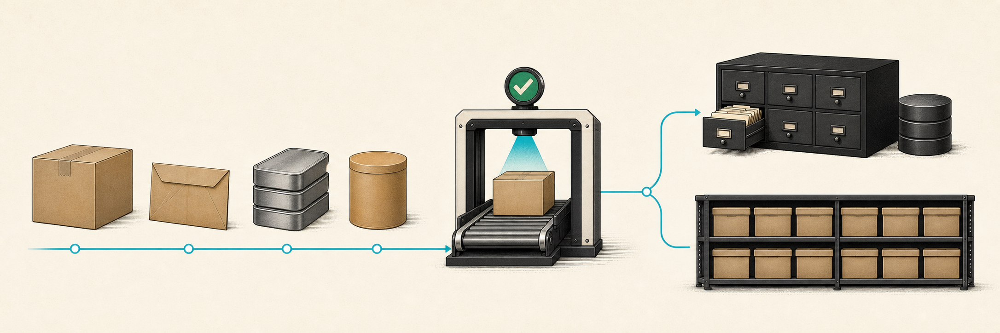
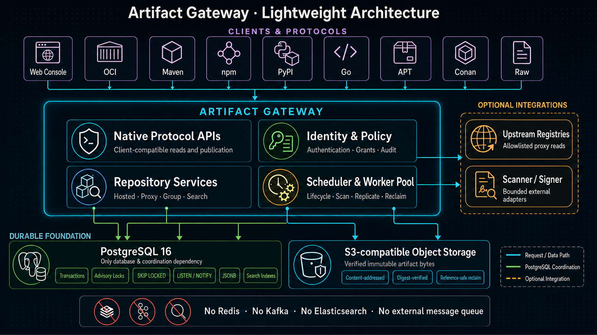

<p align="center">
  
</p>

<h1 align="center">Artifact Gateway</h1>

<p align="center">
  A lightweight, protocol-native repository for verified software artifacts.
</p>

<p align="center">
  <a href="README.zh-CN.md">简体中文</a> ·
  <a href="docs/README.md">Documentation</a> ·
  <a href="ARCHITECTURE.md">Architecture</a> ·
  <a href="CONTRIBUTING.md">Contributing</a>
</p>

<p align="center">
  <a href="https://github.com/ccsert/artifact-gateway/actions/workflows/ci.yml"></a>
  <a href="https://github.com/ccsert/artifact-gateway/releases/tag/v0.1.0"></a>
  <a href="LICENSE"></a>
  
  
  
  
</p>

> [!IMPORTANT]
> **Project status: early release.** Version 0.1.0 is the first packaged
> distribution. It is suitable for evaluation and controlled migration work,
> but pre-1.0 contracts can still evolve and it does not imply production
> support commitments.

## Why Artifact Gateway

Artifact Gateway keeps the operational control plane intentionally small:

- **One Gateway binary.** The same image can run as a compact standalone node
  or split into API, scheduler, and worker roles.
- **PostgreSQL is the only coordination and database dependency.** Repository
  state, authorization, lifecycle jobs, leases, locks, idempotency, audit, and
  operational coordination all use PostgreSQL.
- **No Redis, Kafka, Elasticsearch, or external message queue is required.**
- **Measured Go footprint.** The current local Docker baseline produced a
  28.88 MiB Linux/arm64 Gateway binary and a 36.06 MiB runtime image. Gateway
  averaged 53.59 MiB at quiet idle and peaked near 104 MiB while serving 128
  concurrent clients; see the [performance baseline](docs/performance-baseline.md)
  for throughput, full-stack memory, methodology, and limits.
- **Artifact bytes stay outside the database.** Verified immutable bytes use
  an S3-compatible object-storage interface; the local stack bundles RustFS.
- **Native protocols remain first-class.** Clients use familiar registry and
  package-manager routes instead of a generic upload-only object browser.

In short: PostgreSQL owns the control plane, S3-compatible storage owns the
byte plane, and Gateway connects the two without adding a middleware fleet.

## Repository capabilities

| Format | Hosted | Proxy | Group | Notes |
| --- | :---: | :---: | :---: | --- |
| OCI | ✓ | ✓ | ✓ | Registry V2 uploads, manifests, tags, ranges, and referrers |
| Raw | ✓ | ✓ | ✓ | PUT/GET/HEAD, ranges, checksums, and resumable upload |
| Maven | ✓ | ✓ | ✓ | Standard Maven/Gradle publication by default; [strict coordinate commit](docs/maven-hosted-publication.md) is optional |
| Conan 2 | ✓ | ✓ | ✓ | Revision-aware publication and lifecycle |
| npm | ✓ | ✓ | ✓ | Native publication, verified cache, merged packuments |
| PyPI | ✓ | ✓ | ✓ | Nexus-root twine upload plus PEP 503/691 reads |
| Go modules | ✓ | ✓ | ✓ | Standard GOPROXY reads; Nexus-compatible version-ZIP publication |
| APT | Preview only | ✓ | ✓ | Hosted signing remains unadvertised until production custody gates pass |

Cargo is a staged parser/identity foundation and NuGet remains roadmap work;
neither is advertised as a usable repository format. The detailed, test-bound
compatibility statement lives in the
[protocol compatibility baseline](docs/protocol-compatibility.md).

Maven Hosted defaults to Nexus-compatible direct publication, so ordinary
`mvn deploy` and Gradle `publish` require no companion step. A repository can
opt in to strict publication when atomic per-coordinate visibility is worth an
additional Gateway commit integration.

For client migration, Maven, npm, PyPI, Raw, and Go Hosted/Proxy/Group targets
also accept the Nexus-style root `/repository/<name>/...`. Requests still use
the canonical protocol authorization, validation, audit, and lifecycle paths;
npm metadata keeps generated tarball URLs on the same compatibility root so
npm lockfiles do not switch route families. Raw pagination and upload discovery,
PyPI uploads, and Go publication also keep response URLs on that root. The name
`maven` remains reserved by Gateway's older canonical Maven prefix; migrate a
Nexus target with that exact name under a different repository name. OCI remains on the specification-
required `/v2/` registry root and therefore needs registry-name or ingress
mapping rather than an HTTP base-path alias.

Beyond protocol reads and writes, the current foundation includes repository
grants, local users and OIDC, service accounts, anonymous-read policy, audit,
search and browse, retention, recoverable deletion, promotion, replication,
webhooks, scanner integration, quarantine, diagnostics, metrics, and backup /
restore workflows. Each area is tracked from the [documentation index](docs/README.md).

## Install 0.1.0

The [0.1.0 Release](https://github.com/ccsert/artifact-gateway/releases/tag/v0.1.0)
contains Linux and macOS archives for amd64/arm64, the static Console bundle,
resolved OpenAPI contracts, and `SHA256SUMS`. Every Gateway archive includes
the server and healthcheck binaries, PostgreSQL migrations, a portable
migration runner, and an environment template. Verify the identity with:

```sh
./gateway version
```

For a binary installation, install `psql`, configure PostgreSQL and
S3-compatible object storage, then apply the bundled migrations before starting
Gateway:

```sh
MIGRATION_DIR=./migrations ./run-migrations.sh
```

Container images are published to GHCR for both release and development use:

```text
ghcr.io/ccsert/artifact-gateway:0.1.0
ghcr.io/ccsert/artifact-gateway-console:0.1.0
ghcr.io/ccsert/artifact-gateway:main
ghcr.io/ccsert/artifact-gateway-console:main
```

`main` is a moving, CI-qualified development snapshot. Release deployments
should pin `0.1.0` or the reported image digest. Package visibility follows
the GitHub repository and GHCR package visibility.

## Quick local start

Prerequisites: Docker with Compose, Node.js 24+, npm, GNU Make, and OpenSSL.

```sh
git clone https://github.com/ccsert/artifact-gateway.git
cd artifact-gateway
make dev-bootstrap
make dev
```

`make dev-bootstrap` creates a private `.env` when needed and generates only
the six credentials required by the local Gateway/PostgreSQL/RustFS stack. It
does not print secrets, overwrite real values, or create a new rollback copy
when no change is needed.

`make dev` builds and starts Gateway, PostgreSQL, and RustFS, installs pinned
Console dependencies when absent, and waits for both the API and Console.

Open the Console at <http://127.0.0.1:4173>. Sign in with the
`GATEWAY_ADMIN_TOKEN` stored in `.env`, then create a Hosted, Proxy, or Group
repository from the Repositories page.

```sh
make dev-status   # Console, proxy, liveness, and readiness checks
make dev-down     # stop only the checkout-managed Console
make down         # stop Compose services and preserve data volumes
```

See [Getting started](docs/getting-started.md) for credential handling,
first-repository guidance, ports, lifecycle commands, and troubleshooting.

## Architecture at a glance



The default `standalone` role runs API, scheduler, and worker responsibilities
in one process. Larger installations can split the same image by role without
introducing a separate queue or service-discovery dependency. See
[Architecture](ARCHITECTURE.md), [Architecture diagrams](docs/architecture-diagrams.md),
and [PostgreSQL capabilities](docs/postgresql-capabilities.md).

## Documentation map

| Need | Start here |
| --- | --- |
| Set up a local checkout | [Getting started](docs/getting-started.md) |
| Understand protocol behavior | [Protocol compatibility](docs/protocol-compatibility.md) |
| Publish Maven Hosted coordinates | [Maven Hosted publication](docs/maven-hosted-publication.md) |
| Understand core boundaries | [Architecture](ARCHITECTURE.md) |
| Explore system and publication flows | [Architecture diagrams](docs/architecture-diagrams.md) |
| Understand PostgreSQL coordination | [PostgreSQL capabilities](docs/postgresql-capabilities.md) |
| Review size, memory, and local concurrency | [Performance baseline](docs/performance-baseline.md) |
| Review current engineering quality | [Project quality assessment](docs/project-quality-assessment.md) |
| Operate identity and access | [User governance](docs/user-governance.md), [OIDC SSO](docs/oidc-sso.md), [Service accounts](docs/service-account-operations.md) |
| Deploy or recover | [Kubernetes](docs/kubernetes-deployment.md), [Distributed deployment](docs/distributed-deployment.md), [Recovery runbook](docs/recovery-runbook.md) |
| Extend a package format | [Format extension guide](docs/format-extension-guide.md) |
| Change the management API | [OpenAPI governance](docs/openapi-governance-plan.md) |
| Browse every maintained guide | [Documentation index](docs/README.md) |

## Development workflow

```sh
make test
make lint
make vet
make coverage
make build
```

Protocol, persistence, Console, and deployment changes have additional focused
gates. Generated OpenAPI clients and server contracts must not be edited by
hand. Read [CONTRIBUTING.md](CONTRIBUTING.md) before changing code, and record
user-visible behavior under `Unreleased` in [CHANGELOG.md](CHANGELOG.md).

New package ecosystems must pass the admission rules in the
[format extension guide](docs/format-extension-guide.md). Adding an enum, route
placeholder, or Console option alone is not considered protocol support.

## License

Artifact Gateway is available under the [MIT License](LICENSE). Third-party
components and assets remain subject to their respective license terms.
