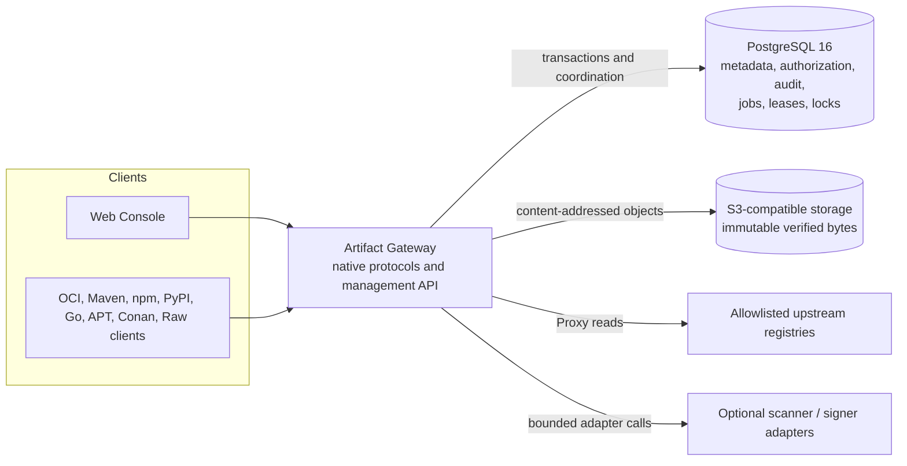
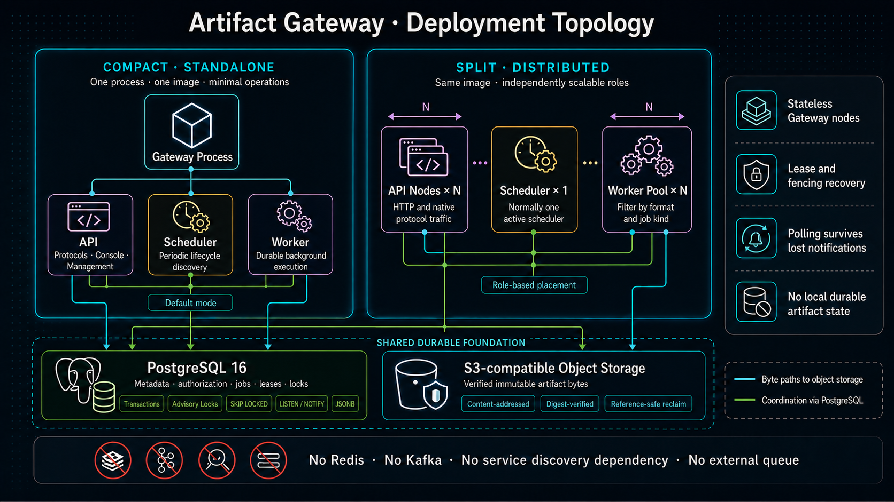
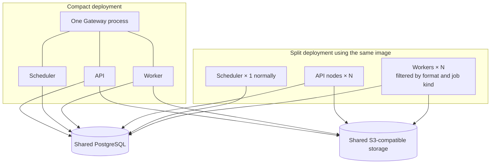
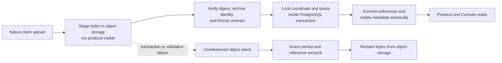
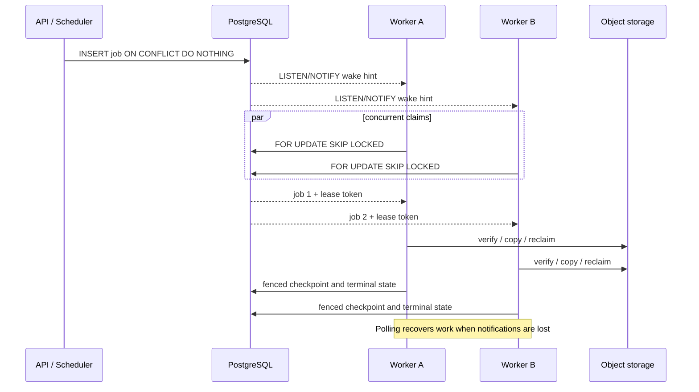

# Architecture diagrams

[简体中文](architecture-diagrams.zh-CN.md) · [Architecture](../ARCHITECTURE.md) · [PostgreSQL capabilities](postgresql-capabilities.en.md)

The generated visual overviews make the main component and deployment choices
easy to scan. The executable Mermaid diagrams below remain the precise,
reviewable source of truth for architecture relationships.

## Visual system overview

## System and storage boundaries

PostgreSQL is the only database and coordination service. S3-compatible object
storage is a separate byte plane; the local stack provides it with RustFS.

## Compact standalone and split-role deployment

The standalone process is the default. Splitting roles changes placement, not
the database, queue, or object-storage contracts; no separate message broker or
service-discovery system is introduced.

## Publication and visibility boundary

Object bytes may exist before publication, but metadata is exposed only after
verification and the PostgreSQL transaction commit. Reclaim never treats a
failed transaction as proof that bytes are safe to delete; it rechecks durable
references after a grace period.

## Durable background work

`LISTEN/NOTIFY` reduces latency but is never the queue of record. Durable rows,
`SKIP LOCKED`, lease expiry, and fencing tokens provide recovery after a worker
or connection disappears.
