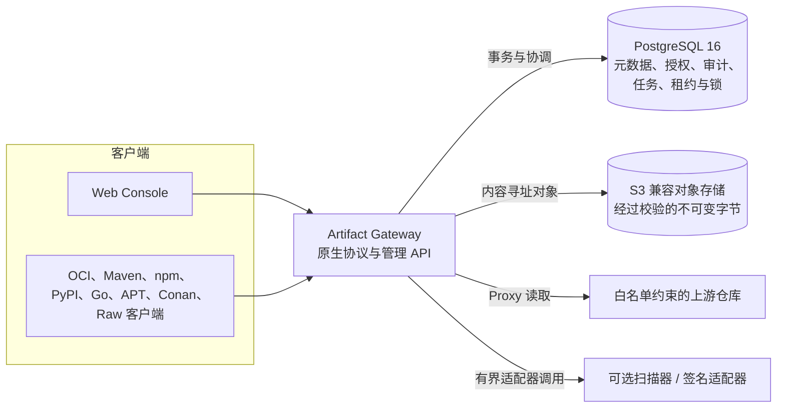
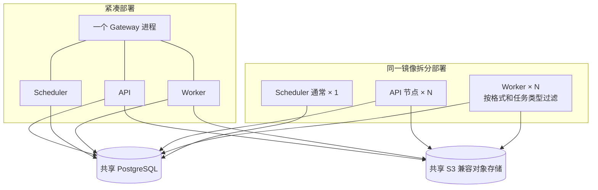
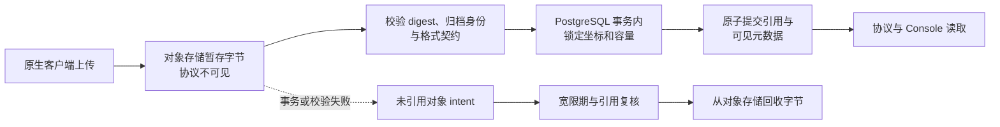
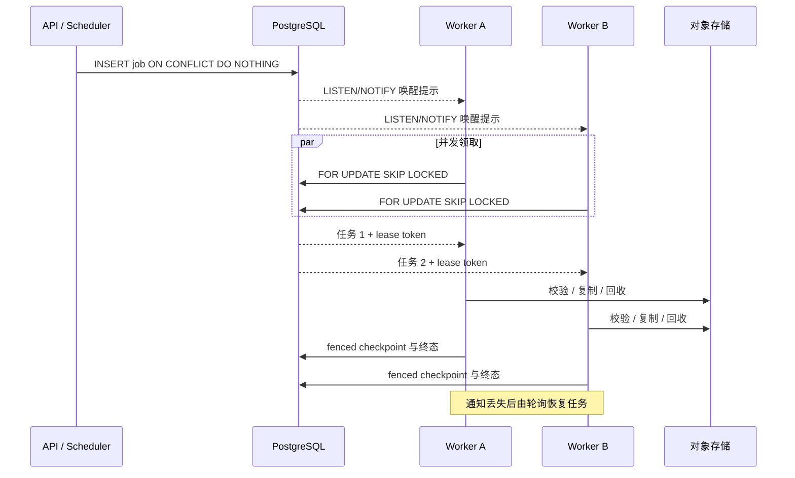

# 架构图

[English](architecture-diagrams.md) · [整体架构](../ARCHITECTURE.md) · [PostgreSQL 能力](postgresql-capabilities.md)

视觉总览图用于快速理解组件与部署选择；下方可执行 Mermaid 图继续作为精确、可评审的
架构关系事实来源。

## 系统视觉总览

## 系统与存储边界

PostgreSQL 是唯一数据库与协调服务；S3 兼容对象存储是独立字节面，本地开发由 RustFS
提供。

## 紧凑单机与角色拆分

默认运行方式是 `standalone`。角色拆分只改变运行位置，不改变数据库、任务或对象存储
契约，也不会额外引入消息队列和服务发现。

## 发布与可见性边界

制品字节可以先于发布写入对象存储，但只有完成校验并提交 PostgreSQL 事务后，元数据才
对客户端可见。事务失败不代表对象一定可以删除；回收任务会等待宽限期并重新检查持久化
引用。

## 持久化后台任务

`LISTEN/NOTIFY` 只降低延迟，不是任务事实来源。持久化任务行、`SKIP LOCKED`、租约过期
和 fencing token 共同处理 Worker 或数据库连接消失后的恢复。
