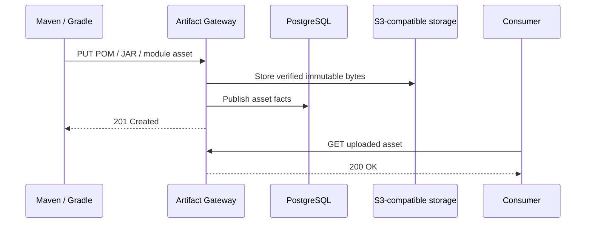

# Maven Hosted Publication

[简体中文](maven-hosted-publication.zh-CN.md)

Status: current runtime contract.

## The default has no companion step

Maven Hosted repositories publish successful standard Maven/Gradle uploads directly by default. Existing `mvn deploy` and Gradle `publish` pipelines can target Artifact Gateway without adding a Gateway-specific commit call.

Strict publication remains available as a repository-level opt-in. It keeps all assets for one coordinate unreadable until a publisher explicitly commits the expected asset set.

| Repository policy | `mavenStrictPublication` | Client workflow | Visibility boundary | Trade-off |
| --- | :---: | --- | --- | --- |
| Direct publication (default) | `false` | Standard Maven/Gradle commands | Each verified successful PUT | Zero-change migration; an interrupted multi-file publication can be partially visible |
| Strict publication | `true` | Standard upload plus Gateway coordinate commit | One PostgreSQL coordinate transaction | Atomic per-coordinate visibility; requires a CI, wrapper, or plugin integration |

This switch changes Hosted publication only. Maven Proxy and Group resolution do not use it.

## Configure the policy

The field is optional and defaults to `false`:

```http
POST /api/v2/repositories HTTP/1.1
Idempotency-Key: create-maven-releases
Content-Type: application/json

{
  "name": "maven-releases",
  "format": "maven",
  "type": "hosted",
  "mavenStrictPublication": false
}
```

It can be changed later with `PATCH /api/v2/repositories/{repositoryId}` and the repository version in `If-Match`. Do not change the policy while a publication is running: a single build must use one visibility model from its first upload through completion.

The Console exposes the same switch when creating or editing a Maven Hosted repository. It is labelled **Strict publication** and is off by default.

## Default direct publication

In the default mode, the Gateway still verifies object bytes, derives SHA-256 identities, validates POM coordinates, enforces immutable release conflicts and quota, and records publication facts in PostgreSQL. After the transaction for a primary asset succeeds, that asset and its Gateway-generated checksum sidecars can be read immediately.

The client may upload checksum sidecars and `maven-metadata.xml`; these requests are accepted for compatibility, but client values are not authoritative. Gateway generates checksums and read metadata from verified objects.



No HTTP-level Maven repository protocol provides a portable “the whole GAV is complete” signal. Maven and Gradle upload POMs, JARs, classifiers, checksums, module metadata, and repository metadata as independent requests in variable order. Direct mode therefore cannot guarantee that consumers never observe an incomplete coordinate if a publisher stops halfway through.

This is the same compatibility class as an ordinary Nexus Repository 3 Maven Hosted repository: standard clients work without a finalize call, and operational recovery handles interrupted file-by-file deployment.

## Strict publication

Enable strict publication only when its atomic visibility is worth the integration cost. Standard PUTs then create an open staging session and return `201`, but reads return `404` until the coordinate commit succeeds.

After the standard upload task completes, call:

```http
POST /repository/maven/releases/coordinates/org.example:widget:1.2.3:commit HTTP/1.1
Authorization: Bearer <repository-writer-token>
Idempotency-Key: build-20260821-widget-1.2.3
Content-Type: application/json

{
  "expectedAssetNames": [
    "widget-1.2.3.pom",
    "widget-1.2.3.jar"
  ]
}
```

`expectedAssetNames` contains primary assets only. Include sources, javadocs, classifiers, and Gradle `.module` assets when the publication produces them. Do not include checksum sidecars or `maven-metadata.xml`.

Gateway validates the complete set, POM identity, session owner, capacity, and immutable conflicts before publishing the coordinate in one PostgreSQL transaction. A commit is a Gateway publication action, not a Git commit or a standard Maven endpoint.

The strict endpoint returns `409 publication_commit_disabled` when the repository uses default direct mode; those PUTs are already visible and must not be presented as staged.

### Retry and failure behavior

- Commit requires an `Idempotency-Key` of at most 128 characters.
- Retries reuse the same key and asset set; asset-name ordering is ignored.
- A publisher can commit only its own open session; administrators may act on another publisher's session.
- Standard-upload sessions remain open for one hour.
- Missing or mismatched POM data, incomplete assets, quota failure, and immutable conflicts do not expose a strict coordinate.
- Release coordinates cannot be overwritten with different bytes.

| Status | Meaning |
| --- | --- |
| `200` | Strict commit succeeded or an identical request replayed |
| `400` | Missing idempotency key or invalid asset list |
| `403` | Missing permission or session ownership |
| `404` | No staged session exists for the coordinate |
| `409` | Strict mode is disabled, the session is closed, or an immutable/idempotency conflict exists |
| `422` | Staged assets cannot form a valid publication |
| `507` | Repository capacity is insufficient |

## How this compares with Nexus staging

Nexus Repository 3 ordinary Maven Hosted uses direct per-request visibility and needs no finalize call. Nexus Repository Pro Staging is a different build workflow: CI tags components in one Hosted repository and moves or deletes matching components across separate Hosted repositories. Its isolation comes primarily from repository separation, Group composition, access policy, and promotion—not from a standard Maven coordinate commit.

Artifact Gateway intentionally offers both choices in one Maven Hosted capability:

- default direct mode minimizes Nexus migration cost;
- optional strict mode gives stronger per-coordinate visibility when a team can support the additional publication action;
- neither mode currently promises atomic publication across several GAVs in one multi-module build.

See [Nexus Maven publication research](nexus-maven-publication-research.md) for the source-backed comparison.

## Executable evidence

`scripts/native-maven-e2e.sh` is the real-client gate. It verifies:

- plain Maven deploy and dependency resolution in default mode, without commit;
- plain Gradle SNAPSHOT publish and resolution in default mode, without commit;
- pre-commit `404`, idempotent commit, immutable replay conflict, and post-commit reads in strict mode;
- Gateway-generated metadata and checksum resolution.
