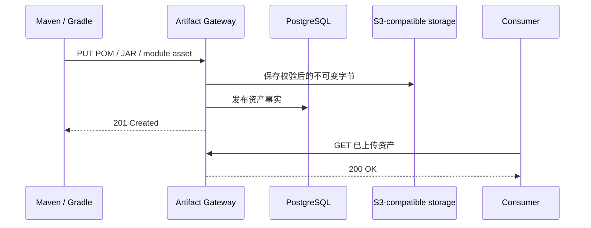

# Maven Hosted 发布流程

[English](maven-hosted-publication.md)

状态：当前运行时契约。

## 默认不需要 companion commit

Maven Hosted 仓库默认采用直接发布：标准 Maven/Gradle 上传成功后即可读取。现有 `mvn deploy` 和 Gradle `publish` 流水线可以直接把目标切换到 Artifact Gateway，不必增加 Gateway 专属提交调用。

需要更强原子可见性的团队，可以按仓库显式开启严格发布。严格模式会让一个坐标的全部资产在发布者提交预期资产集合之前保持不可读。

| 仓库策略 | `mavenStrictPublication` | 客户端流程 | 可见性边界 | 取舍 |
| --- | :---: | --- | --- | --- |
| 直接发布（默认） | `false` | 标准 Maven/Gradle 命令 | 每个经过验证且成功的 PUT | Nexus 迁移零改造；多文件发布中断时可能出现部分可见 |
| 严格发布 | `true` | 标准上传 + Gateway 坐标提交 | 一次 PostgreSQL 坐标事务 | 单坐标原子可见；需要 CI、包装脚本或插件集成 |

这个开关只影响 Hosted 发布；Maven Proxy 和 Group 解析不使用它。

## 配置开关

字段可省略，默认值是 `false`：

```http
POST /api/v2/repositories HTTP/1.1
Idempotency-Key: create-maven-releases
Content-Type: application/json

{
  "name": "maven-releases",
  "format": "maven",
  "type": "hosted",
  "mavenStrictPublication": false
}
```

之后可通过 `PATCH /api/v2/repositories/{repositoryId}` 修改，并在 `If-Match` 中携带仓库版本。不要在发布任务执行中切换：一次构建从第一个上传到结束必须使用同一种可见性模型。

Console 在创建和编辑 Maven Hosted 仓库时提供同一个“严格发布”开关，并且默认关闭。

## 默认直接发布

默认模式仍会校验对象字节、派生 SHA-256 身份、验证 POM 坐标、执行 Release 不可变冲突与容量配额检查，并把发布事实写入 PostgreSQL。一个主要资产的事务成功后，该资产和 Gateway 生成的 checksum sidecar 立即可读。

客户端可以上传 checksum sidecar 和 `maven-metadata.xml`；Gateway 为兼容客户端接受这些请求，但不把客户端内容当成权威数据。读取侧 checksum 和 metadata 由经过验证的对象生成。



HTTP 层的 Maven 仓库协议不存在通用的“整个 GAV 已上传完毕”信号。Maven/Gradle 会以不固定顺序分别上传 POM、JAR、classifier、checksum、module metadata 和仓库 metadata。因此，如果发布者执行到一半中断，直接模式无法保证消费者永远看不到不完整坐标。

这与普通 Nexus Repository 3 Maven Hosted 属于同一兼容性类型：标准客户端不需要 finalize 调用，文件级发布中断由运维恢复流程处理。

## 严格发布

只有在单坐标原子可见性值得额外集成成本时才开启严格发布。标准 PUT 此时创建开放的暂存 Session 并返回 `201`，但在坐标提交成功前读取返回 `404`。

标准上传任务完成后调用：

```http
POST /repository/maven/releases/coordinates/org.example:widget:1.2.3:commit HTTP/1.1
Authorization: Bearer <repository-writer-token>
Idempotency-Key: build-20260821-widget-1.2.3
Content-Type: application/json

{
  "expectedAssetNames": [
    "widget-1.2.3.pom",
    "widget-1.2.3.jar"
  ]
}
```

`expectedAssetNames` 只列主要资产。发布 sources、javadocs、classifier 或 Gradle `.module` 时也要列入；不要列 checksum sidecar 或 `maven-metadata.xml`。

Gateway 会校验完整资产集合、POM 身份、Session 所有者、容量和不可变冲突，再用一次 PostgreSQL 事务公开坐标。这个 commit 是 Gateway 发布动作，不是 Git commit，也不是 Maven 标准端点。

默认直接模式调用严格提交端点会返回 `409 publication_commit_disabled`；该模式下成功的 PUT 已经可见，不能再被描述成暂存状态。

### 重试与错误行为

- commit 必须携带不超过 128 个字符的 `Idempotency-Key`；
- 重试复用相同幂等键和资产集合，资产名顺序不影响比较；
- 普通发布者只能提交自己的开放 Session，管理员可以处理其他发布者的 Session；
- 标准上传创建的 Session 保持开放一小时；
- POM 缺失或不匹配、资产不完整、容量不足和不可变冲突都不会暴露严格坐标；
- Release 坐标不能被不同字节覆盖。

| 状态 | 含义 |
| --- | --- |
| `200` | 严格提交成功，或相同请求幂等重放 |
| `400` | 缺少幂等键，或资产列表无效 |
| `403` | 缺少权限，或不是 Session 所有者 |
| `404` | 该坐标不存在可提交的暂存 Session |
| `409` | 未开启严格模式、Session 已关闭，或存在不可变/幂等冲突 |
| `422` | 暂存资产无法组成有效发布 |
| `507` | Repository 容量不足 |

## 与 Nexus Staging 的关系

Nexus Repository 3 的普通 Maven Hosted 采用逐请求直接可见，不需要 finalize。Nexus Repository Pro Staging 是另一套构建工作流：CI 在一个 Hosted 仓库中按 tag 标记组件，再把匹配组件移动到其他 Hosted 仓库或按 tag 删除。它主要通过仓库隔离、Group 组成、访问策略和晋升获得隔离，而不是通过 Maven 标准坐标提交。

Artifact Gateway 在 Maven Hosted 中明确提供两种选择：

- 默认直接模式降低从 Nexus 迁移的成本；
- 可选严格模式在团队能承担额外发布动作时提供更强的单坐标可见性；
- 两种模式目前都不承诺一个多模块构建内多个 GAV 的整体原子发布。

带官方资料依据的详细比较见 [Nexus Maven 发布行为研究](nexus-maven-publication-research.md)。

## 可执行证据

`scripts/native-maven-e2e.sh` 是真实客户端门禁，覆盖：

- 默认模式下 Maven 原生 deploy 与依赖解析，全程不调用 commit；
- 默认模式下 Gradle SNAPSHOT publish 与解析，全程不调用 commit；
- 严格模式 commit 前 `404`、幂等提交、不可变重放冲突和提交后读取；
- Gateway 生成的 metadata 与 checksum 解析。
