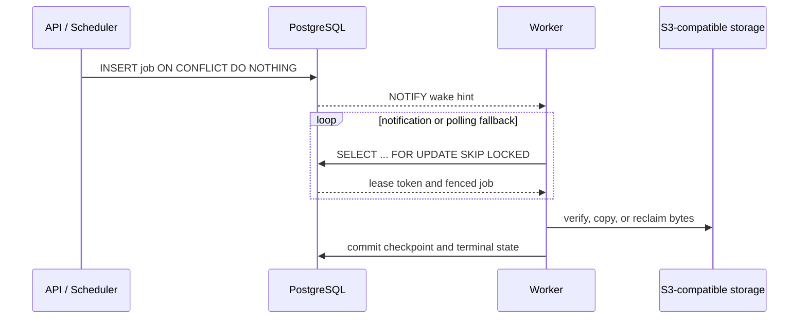

# PostgreSQL capabilities and operational boundaries

[简体中文](postgresql-capabilities.md) · [Architecture diagrams](architecture-diagrams.md) · [Documentation index](README.md)

The runtime baseline is PostgreSQL 16. Artifact Gateway uses PostgreSQL as its
only database and control-plane coordination service. Repositories,
authorization, artifact metadata, audit records, idempotency keys, background
jobs, leases, locks, and runtime-node state all treat PostgreSQL as the source
of truth.

“Lightweight” does not mean PostgreSQL is the only storage system. Verified
immutable artifact bytes remain in S3-compatible object storage; the local
stack bundles RustFS. Redis, Kafka, Elasticsearch, and a separate message queue
are not required.

## PostgreSQL-native or PostgreSQL-bound capabilities

Some entries below are PostgreSQL-specific; others exist in additional
databases, but Artifact Gateway relies on their PostgreSQL syntax and failure
semantics.

| Capability | Use in Artifact Gateway | Why it matters |
| --- | --- | --- |
| Session and transaction advisory locks | OCI/Raw uploads, object deduplication, cache fills, first Maven/npm publication, user administration, lifecycle serialization | Logical resources do not need a dedicated lock table; locks release with the connection or transaction |
| `hashtextextended` lock keys | Maps repository names, object keys, upload IDs, and package coordinates into one stable 64-bit lock space | Every Gateway instance derives the same lock for the same logical resource |
| `FOR UPDATE SKIP LOCKED` | Claims lifecycle, replication, cache, webhook, audit, upload-expiry, session-cleanup, and scheduled work | Workers claim different rows concurrently without a separate queue or lock convoy |
| `LISTEN/NOTIFY` | Wakes lifecycle, replication, cache, audit-cleanup, and repository-deletion workers | Reduces polling latency while durable tables and leases remain authoritative |
| PL/pgSQL triggers | Emits `pg_notify` when work becomes runnable and enforces selected capacity boundaries | State changes and wake hints share the database transaction boundary |
| `ON CONFLICT`, unique constraints, and `RETURNING` | Idempotent publication, task deduplication, object references, node heartbeats, singleton settings, and tag movement | Existence checks, writes, and state readback remain one concurrency-safe statement |
| JSONB and JSONB operators | npm manifests/tags, OIDC roles, scanner intelligence, webhook payloads, dynamic policy, runtime roles | Keeps relational identity while representing format-specific data with JSON type checks |
| `pg_trgm` and partial GIN indexes | Fuzzy Maven coordinate, OCI name, Conan reference, and Raw path search | Indexes only relevant visible states and avoids full scans |
| `text_pattern_ops` B-tree indexes | Literal prefix paging across Maven, OCI, Raw, Conan, npm, PyPI, Go, and APT | Preserves indexed `LIKE 'prefix%'` behavior outside the `C` locale |
| BRIN indexes | Audit, lifecycle, replication-checkpoint, OCI, and Conan timelines | Keeps append-heavy time indexes compact |
| `DISTINCT ON`, `LATERAL`, and views | Builds the format-neutral `artifact_search_projection` and selects latest visible records | Performs format projection and version folding in PostgreSQL while authorization remains in the application |
| `pg_stat_statements` | Observes query calls, total/mean execution time, and returned rows | Tunes from real workload evidence rather than static guesses |
| `gen_random_uuid`, `TIMESTAMPTZ`, intervals | Lease tokens, schedule run IDs, expiry, and retry timing | Creates fencing identity and database-consistent time inside claim statements |

## Coordination model



- Losing a notification does not lose work; workers continue polling durable
  task tables.
- `SKIP LOCKED` gives non-blocking claims. Lease tokens and expiry provide
  cross-process recovery and stale-worker fencing.
- Session advisory locks are tied to dedicated connections; transaction locks
  release on commit or rollback.
- PostgreSQL transactions decide metadata visibility. Bytes may be staged in
  object storage first; object intents and reclaim work recover unreferenced
  bytes after a transaction failure.

## Search and index composition

1. Literal prefixes use `text_pattern_ops` B-tree indexes and ordered cursors.
2. Contains/fragment matching uses `pg_trgm` GIN indexes.
3. Partial indexes exclude states that are not protocol-visible.
4. Append-heavy timelines use BRIN instead of ever-growing B-tree indexes.
5. `artifact_search_projection` uses `UNION ALL`, `DISTINCT ON`, and `LATERAL`
   to normalize format metadata; application code still authorizes results.
6. SHA-256 lookup uses repository-and-digest composite indexes, not fuzzy search.

## Operational queries

```sql
SELECT calls, total_exec_time, mean_exec_time, rows, query
FROM pg_stat_statements
WHERE dbid = (SELECT oid FROM pg_database WHERE datname = current_database())
ORDER BY total_exec_time DESC
LIMIT 20;
```

```sql
EXPLAIN (ANALYZE, BUFFERS)
SELECT coordinate
FROM artifact_search_projection
WHERE repository_id = '<repository-id>'
  AND format = 'maven'
  AND coordinate LIKE 'org.example:%'
ORDER BY coordinate, build_number
LIMIT 50;
```

```sql
SELECT pid, wait_event_type, wait_event, state, query
FROM pg_stat_activity
WHERE datname = current_database()
  AND wait_event_type IS NOT NULL
ORDER BY backend_start;
```

## Explicitly not used

- **RLS:** tables do not yet share a tenant ID or consistent session tenant
  context across workers and administrator flows.
- **Table partitioning:** current audit/job volume has not justified monthly
  range partitions.
- **Logical replication as a task bus:** durable tables, leases, and polling
  recover work without WAL/CDC consumers.
- **Large objects or `bytea` artifacts:** object storage owns content-addressed
  bytes; PostgreSQL stores digests, references, object intents, and lifecycle
  state.

## Code evidence

| Area | Primary implementation |
| --- | --- |
| Advisory locks | `internal/cache/coordinator.go`, `internal/repository/postgres_advisory_lock.go`, `postgres_{oci,raw,maven,npm}.go` |
| `SKIP LOCKED` and leases | `internal/repository/postgres_lifecycle.go`, `postgres_replication.go`, `postgres_webhooks.go`, `postgres_scheduled_tasks.go` |
| `LISTEN/NOTIFY` | `internal/database/notification.go`, `migrations/000066_postgres_notification_channels.sql` |
| Extensions and indexes | `migrations/000064_postgres_observability_indexes.sql`, `000069_prefix_pattern_indexes.sql` |
| Cross-format search | `migrations/000065_artifact_search_projection.sql` and later format migrations |
| Capacity serialization | `migrations/000046_repository_capacity_enforcement.sql` and format-specific capacity functions |

`scripts/run-migrations.sh` applies migrations in checksum order. Changes to
startup settings such as `shared_preload_libraries` require a PostgreSQL restart
or container rebuild, never deletion of the `gateway-postgres` data volume.
