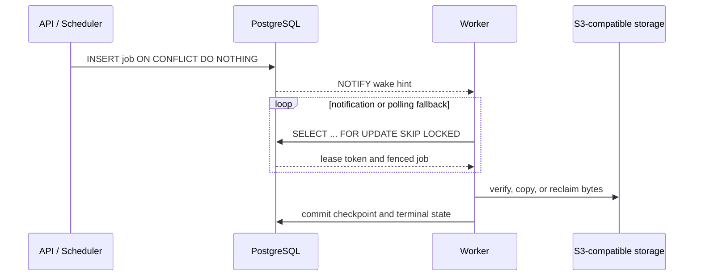

# PostgreSQL 能力与运维边界

[English](postgresql-capabilities.md) · [架构图](architecture-diagrams.zh-CN.md) · [文档索引](README.zh-CN.md)

当前运行基线为 PostgreSQL 16。Artifact Gateway 把 PostgreSQL 作为唯一的数据库与
控制面协调服务：仓库、授权、制品元数据、审计、幂等键、后台任务、租约、锁和运行节点
状态都以 PostgreSQL 为事实来源。

这里的“轻量级”不等于“只需要 PostgreSQL 一个存储系统”。经过校验的不可变制品字节
仍然保存在 S3 兼容对象存储中，本地开发栈使用 RustFS。项目不需要 Redis、Kafka、
Elasticsearch 或独立消息队列。

## PostgreSQL 原生或强绑定能力

下表既包含 PostgreSQL 特有能力，也包含其他数据库可能提供、但本项目明确依赖
PostgreSQL 语法与行为的能力。

| 能力 | 项目中的用途 | 为什么重要 |
| --- | --- | --- |
| Session / transaction advisory lock | OCI/Raw 上传、对象去重、缓存填充、Maven/npm 首次发布、用户管理与生命周期串行化 | 不需要为每一种逻辑资源额外建立锁表；连接断开或事务结束后自动释放 |
| `hashtextextended` + advisory lock | 把仓库、对象键、上传 ID、包坐标等稳定字符串映射为 64 位锁键 | 让不同 Gateway 实例对同一个逻辑资源使用完全相同的锁空间 |
| `FOR UPDATE SKIP LOCKED` | 生命周期、复制、缓存、Webhook、审计清理、过期上传、会话清理和定时任务领取 | 多个 Worker 可以并行领取不同任务，不需要独立消息队列，也不会被已锁行阻塞 |
| `LISTEN/NOTIFY` | 唤醒生命周期、复制、缓存、审计清理和仓库删除 Worker | 降低纯轮询延迟；通知只是提示，任务表和租约仍是事实来源 |
| PL/pgSQL trigger | 在任务进入可执行状态时调用 `pg_notify`；执行容量约束等数据库边界逻辑 | 状态变更与唤醒提示在同一数据库事务边界内发生 |
| `ON CONFLICT` + unique constraint + `RETURNING` | 幂等发布、任务去重、对象引用、运行节点心跳、配置单例和标签更新 | 将“判断是否存在”和“写入/回读”压缩到一个并发安全语句 |
| JSONB 与 JSONB 运算符 | npm manifest/dist-tag、OIDC 角色、扫描情报、Webhook payload、动态策略和运行角色 | 保留强关系主键的同时容纳格式特定结构，并用 `CHECK` 约束 JSON 类型 |
| `pg_trgm` + partial GIN index | Maven 坐标、OCI 名称、Conan reference、Raw 路径的模糊检索 | 对可见制品建立有针对性的倒排索引，避免全表扫描和无效状态索引膨胀 |
| `text_pattern_ops` B-tree index | Maven/OCI/Raw/Conan/npm/PyPI/Go/APT 的字面前缀分页 | 在非 `C` locale 下仍为转义后的 `LIKE 'prefix%'` 提供稳定索引路径 |
| BRIN index | 审计、生命周期、复制检查点、OCI/Conan 创建时间线 | 追加型大表以较小索引体积支持时间范围扫描 |
| `DISTINCT ON`, `LATERAL`, view | `artifact_search_projection` 跨格式统一搜索，并选择每个坐标的最新可见记录 | 在数据库内完成格式投影与版本折叠，应用层继续负责授权 |
| `pg_stat_statements` | 查询调用量、总耗时、平均耗时和返回行数观测 | 用真实工作负载定位慢查询和高频查询，而不是只凭静态猜测优化 |
| `gen_random_uuid`, `TIMESTAMPTZ`, interval | 租约 token、调度运行 ID、过期时间和重试时间 | 由数据库在领取任务的原子语句中生成 fencing 身份与一致时间 |

## 协调模型



关键约束：

- `NOTIFY` 丢失不会丢任务，Worker 会继续轮询持久化任务表。
- `SKIP LOCKED` 只负责无阻塞领取；lease token 和过期时间负责跨进程故障恢复与 stale
  Worker fencing。
- session advisory lock 与专用连接绑定，连接关闭会释放；transaction advisory lock 在
  提交或回滚时释放。
- PostgreSQL 事务决定元数据何时可见，对象字节可以先写入 S3；事务失败后由 object
  intent 与回收任务处理未引用对象。

## 搜索与索引组合

搜索不是“给所有列加一个 GIN”：

1. 字面前缀使用 `text_pattern_ops` B-tree，保持有序游标分页。
2. 包含匹配和长坐标片段使用 `pg_trgm` GIN。
3. `state = 'visible'` 等 partial index 只覆盖协议可见数据。
4. 追加型时间线使用 BRIN，避免 B-tree 随历史记录线性膨胀。
5. `artifact_search_projection` 使用 `UNION ALL`、`DISTINCT ON` 与 `LATERAL` 将多个格式
   投影到统一元数据结构；仓库授权仍在应用层执行。
6. SHA-256 查询走 repository + digest 复合索引，不使用模糊搜索。

## 运维查询

最耗时查询：

```sql
SELECT calls, total_exec_time, mean_exec_time, rows, query
FROM pg_stat_statements
WHERE dbid = (SELECT oid FROM pg_database WHERE datname = current_database())
ORDER BY total_exec_time DESC
LIMIT 20;
```

验证前缀搜索是否命中预期索引：

```sql
EXPLAIN (ANALYZE, BUFFERS)
SELECT coordinate
FROM artifact_search_projection
WHERE repository_id = '<repository-id>'
  AND format = 'maven'
  AND coordinate LIKE 'org.example:%'
ORDER BY coordinate, build_number
LIMIT 50;
```

检查等待锁：

```sql
SELECT pid, wait_event_type, wait_event, state, query
FROM pg_stat_activity
WHERE datname = current_database()
  AND wait_event_type IS NOT NULL
ORDER BY backend_start;
```

## 明确没有使用的能力

- **RLS**：当前表没有统一 `tenant_id`，后台 Worker 和管理员流程也没有一致的会话租户
  上下文。确定租户模型前不启用 Row Level Security。
- **表分区**：当前审计和任务体量尚未证明月度 RANGE 分区的收益。达到稳定百万级数据并
  以时间批量清理时再引入。
- **逻辑复制作为任务总线**：后台任务以任务表、租约和轮询为事实来源，不依赖 WAL 消费
  或 CDC 才能恢复。
- **数据库大对象/`bytea` 存制品**：对象存储继续保存内容寻址字节，PostgreSQL 只保存
  digest、引用、object intent 和生命周期状态。

## 代码证据

| 主题 | 主要实现位置 |
| --- | --- |
| Advisory lock | `internal/cache/coordinator.go`, `internal/repository/postgres_advisory_lock.go`, `postgres_{oci,raw,maven,npm}.go` |
| `SKIP LOCKED` 与租约 | `internal/repository/postgres_lifecycle.go`, `postgres_replication.go`, `postgres_webhooks.go`, `postgres_scheduled_tasks.go` |
| `LISTEN/NOTIFY` | `internal/database/notification.go`, `migrations/000066_postgres_notification_channels.sql` |
| PostgreSQL 扩展与索引 | `migrations/000064_postgres_observability_indexes.sql`, `000069_prefix_pattern_indexes.sql` |
| 跨格式搜索投影 | `migrations/000065_artifact_search_projection.sql` 及后续格式迁移 |
| 容量串行化 | `migrations/000046_repository_capacity_enforcement.sql` 及各格式容量函数 |

迁移由 `scripts/run-migrations.sh` 按文件校验和顺序执行。修改
`shared_preload_libraries` 等启动参数需要重启或重建 PostgreSQL 容器，但不得因此删除
`gateway-postgres` 数据卷。
