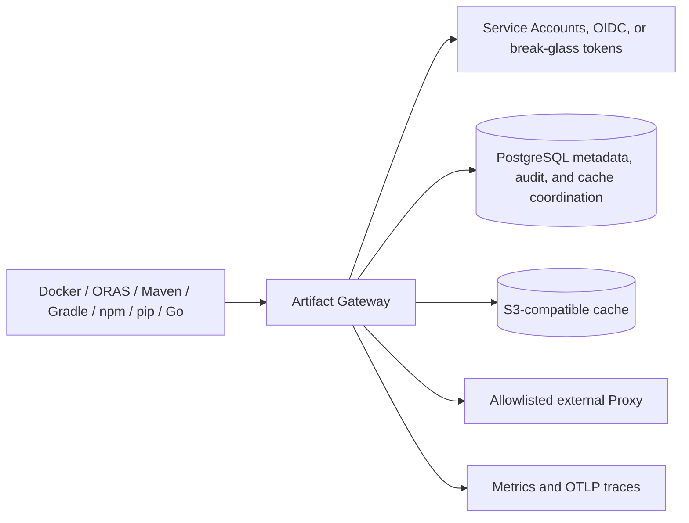

# Full Artifact Repository V1 Release Readiness

[简体中文](release-readiness.zh-CN.md) | [Documentation index](README.md)

This document is the release gate for Artifact Gateway's OCI, Maven, Raw,
Conan, npm, and PyPI Hosted/Proxy lifecycle and distribution paths plus the Go
Module atomic Hosted publication and Hosted/Proxy/Group read paths.
The gate also carries the unadvertised APT Hosted signing preview through a
real Debian client and exact signed-snapshot recovery rehearsal; passing it does
not promote APT Hosted into the V1 compatibility claim.
Run it from a clean checkout on a Docker Desktop workstation with a configured
local `.env`; it does not require an external package service or production
credentials.

```sh
make integration-test
make test
make native-oci-e2e
make native-raw-e2e
make native-maven-e2e
make native-npm-e2e
make native-pypi-e2e
make native-go-e2e
make native-apt-e2e
make apt-signer-rotation-e2e
make cargo-contract
make conan-e2e
make readiness-e2e
make resolver-rotation-e2e
make service-account-rotation-e2e
make oci-performance-e2e
make cache-operations-e2e
make openapi-check
make console-typecheck
make console-check
make console-test
make console-build
make console-e2e
make upgrade-readiness
make backup-restore-readiness
```

`make test` includes the isolated `dev/dev-status/dev-down` public CLI boundary
tests. The commands exercise native protocol fixtures, persistent metadata,
dependency readiness, token rotation, performance, Console contract/build/browser
behavior, upgrade, and restore behavior. Record
their output, Git revision, operator, UTC start/end, and any deviation in the
[release record](release-record-template.md). Do not include bearer tokens,
storage credentials, or unredacted upstream URLs in that record.

## Release Checklist

- [ ] `make test`, `make integration-test`, `make native-oci-e2e`,
	  `make native-raw-e2e`, `make native-maven-e2e`, `make native-npm-e2e`,
	  `make native-pypi-e2e`, `make native-go-e2e`, `make native-apt-e2e`,
	  `make apt-signer-rotation-e2e`,
      and `make conan-e2e`
      pass.
- [ ] `make integration-test` includes PostgreSQL and RustFS worker evidence for
      promotion and checkpointed replication of OCI, Maven, Raw, and Conan
      Artifacts. It verifies verified-object publication, retry/resume, and
      SHA-256 verification. It also runs migrations twice to prove the tracked
      second pass is a no-op and rejects checksum drift in previously applied
      files; it does not run the backup/restore rehearsal.
- [ ] OCI publish/pull semantics pass through the native OCI fixture. Maven
      publish and resolution pass through the native Maven fixture.
      npm scoped/unscoped publication, immutable versions, dist-tags, anonymous
      installation, and audit pass through the native npm fixture. The same
      real npm CLI then installs Hosted and Proxy packages through one npm
      Group Registry, shuts down the Proxy upstream, clears the client cache,
	  and installs both sources again through the Group from Gateway storage.
	  PyPI uses real twine and pip clients to publish Hosted content, install
	  Proxy content through a Group, stop the upstream, and reinstall from the
	  verified local cache.
      Go first publishes a canonical module ZIP to Hosted and completes a real
      `go mod download`, then separately downloads through Proxy, stops its
      upstream, clears the module cache, and downloads the same `.info`, `.mod`,
      and `.zip` assets from Gateway storage.
      The unadvertised APT Hosted preview builds a real `.deb`, publishes and
      installs a signed snapshot, captures all signed/index/package digests,
      backs up PostgreSQL and RustFS, publishes a later snapshot, restores the
      original one byte-for-byte, then installs it again with the signer
      offline.
      Raw HTTP covers live-Gateway public GET/HEAD/range, anonymous allow and
      denial, canonical-path rejection, negative cache, Proxy allowlist denial,
      source-outage cache recovery, audit, and metrics. Conan 2.21.0 covers the v2
      handshake, revisioned recipe/package downloads, cache, checksum failure,
      anonymous policy, and Proxy allowlist denial.
- [ ] `make readiness-e2e` verifies `/readyz` returns `503` while RustFS or
      PostgreSQL is stopped and `204` after each is restored.
- [ ] `make cache-operations-e2e` verifies cache collection is administrator-only,
      succeeds for an administrator, and increases the successful-run count.
      Its deterministic retention behavior is covered by
      `internal/app/cache_maintenance_test.go`.
- [ ] `make openapi-check`, `make console-typecheck`, `make console-check`,
      `make console-test`, `make console-build`, and `make console-e2e` verify
      the generated `/api/v2` management client, lint/format/accessibility
      rules, component behavior and coverage, the Console production build,
      and an authenticated administrator dashboard session through the Console
      API proxy.
- [ ] Maven retention maintenance runs outside request handling, preserves the
      configured newest versions per module, and tombstones only expired excess
      coordinates before the Maven orphan collector reclaims bytes.
- [ ] `make resolver-rotation-e2e` rejects an OCI bearer token issued by the
      old resolver token after Gateway restart and permits a newly issued token.
- [ ] `make service-account-rotation-e2e` creates an isolated CI Service
      Account, binds one Repository Grant to its stable principal, proves old
      and new credentials overlap during rotation, revokes only the old
      credential, and finally proves disabling the Service Account rejects the
      remaining credential without changing the grant.
- [ ] `make oci-performance-e2e` completes cached OCI manifest reads with the
      default 50 requests at concurrency 10, zero errors, and p95 latency at or
      below one second. Override only with an approved release record using
      `GATEWAY_PERFORMANCE_REQUESTS`, `GATEWAY_PERFORMANCE_CONCURRENCY`,
      `GATEWAY_PERFORMANCE_P95_MS`, and `GATEWAY_PERFORMANCE_MAX_ERROR_PERCENT`.
- [ ] `make upgrade-readiness` deploys `GATEWAY_UPGRADE_FROM_REF` (default
      `324aba95`) into fresh isolated volumes, migrates it to the current
      checkout while retaining the same PostgreSQL and RustFS state, verifies
      persisted Maven object bytes and OCI/Maven Groups, and uses the real Go
      client to resolve a base Go Proxy module after its upstream is made
      unreachable. It then publishes and resolves a current Go Hosted module,
      creates current Raw/Conan Group state, starts the prior revision against
      those volumes, re-verifies the base OCI, Maven, and Go Proxy state, and
      finally rolls forward to prove both Go Proxy and Go Hosted content remain
      readable. V2 migrations are additive: a rollback binary must not need V2
      rows to serve existing OCI Groups. This is an application/schema upgrade
      gate; the project no longer ships a legacy object-store migration path.
- [ ] Before rolling out migration `000095`, stop accepting new replication
      requests, drain every pre-upgrade replication plan to a terminal state,
      and stop all old replication workers. Apply the migration and start only
      new workers before reopening replication traffic or allowing Quarantine
      transitions. Old and new replication workers must not overlap after
      Quarantine is enabled because the old worker does not enforce it. Verify
      every current plan has both coordinate and digest, never only one. A new
      worker intentionally fails a non-terminal legacy plan with both fields
      empty instead of publishing it; resolve such a plan explicitly rather
      than bypassing that fail-closed result.
- [ ] `make backup-restore-readiness` runs PostgreSQL and RustFS backup/restore
      against isolated volumes. It creates OCI, Maven, Raw, Conan, and Go source
      Artifacts through HTTP, creates and replays promotion jobs and replication
      plans for the lifecycle-enabled formats, then verifies all saved
      instructions and their management audit records after restore. For Go it
      runs a real `go mod download` before and after restore, verifies the exact
      `.info`, `.mod`, and `.zip` digests plus durable publication-recovery
      intents, and proves a post-backup module mutation is absent from both the
      protocol surface and RustFS. It also
      verifies restored Raw cache content, artifact quarantine state and reason,
      Conan Group state, Repository grant version/content, and the Native Raw
      authorization denial/allow behavior. Run `make backup-drill`
      against the release environment only after the isolated rehearsal passes.
- [ ] `make native-apt-e2e` proves exact recovery of an immutable signed APT
      snapshot in addition to the broader backup rehearsal: signing-state
      evidence, `Release`, both signatures, direct/by-hash indices, and package
      bytes must all match the pre-mutation backup after PostgreSQL/RustFS
      restore. The signer key volume is intentionally not part of this proof.
- [ ] `make apt-signer-rotation-e2e` provisions two signer-owned private-key
      volumes, exposes both signers only over CA-verified HTTPS, and proves a
      real Debian client before, during, and after the old/new trust overlap.
      It must also prove that an old-key-only client rejects the new snapshot
      with a concrete signature error, and that the serving signer mounts both
      its pre-provisioned signing key and validated TLS materials read-only.
- [ ] Review `/metrics`, `/api/v1/audits`, cache capacity, configured upstream
      allowlists, Repository grant sets, quotas, and OIDC issuer/audience. For
      a grant rollout, review the bounded authorization signal without adding
      actor or Repository labels:

      ```promql
      sum by (format, authorization_reason) (
        increase(artifact_gateway_repository_authorization_denials_total[15m])
      )
      ```

      Background queue gauges are rebuilt from PostgreSQL at startup and after
      queue notifications. Review actionable depth and the oldest wait before
      approving a release:

      ```promql
      sum by (kind, format, state) (
        artifact_gateway_background_jobs{state=~"pending|retrying"}
      )
      max by (kind, format) (
        artifact_gateway_background_queue_oldest_actionable_age_seconds
      )
      ```

## Default Operating Policy

| Area | MVP default |
| --- | --- |
| Hosted source | Native PostgreSQL metadata and RustFS S3-compatible object bytes |
| External Proxy | Disabled unless the exact upstream host is in the protocol allowlist |
| Authentication | Service Accounts with rotating credentials for CI/applications; HTTPS RS256 OIDC for human production identity; static resolver/admin tokens only for local break-glass |
| Authorization | Deny unmatched repository readers when `GATEWAY_REPOSITORY_READERS` is configured |
| OCI cache | Read-through, content-addressed S3 storage; cleanup every five minutes after TTL grace period |
| Maven cache | Component files: 15 minutes; metadata and negative results: one minute |
| Backup target | PostgreSQL metadata plus RustFS object data; 24-hour RPO, 30-minute RTO drill target |
| OCI performance gate | 50 cached manifest reads, concurrency 10, zero errors, p95 <= 1000 ms |
| Cache operations gate | Resolver denied; administrator collection increases successful-run count |
| Upgrade gate | Previous RustFS revision `324aba95`, isolated object-store volumes, current migration, protocol regression, binary rollback |

## Architecture



## Known Limitations

- V1 supports OCI, Maven, Raw, Conan, npm, PyPI, and Go Hosted lifecycle paths.
  Checkpointed replication and promotion workers publish verified Artifacts for
  OCI, Maven, Raw, Conan, npm, PyPI, and Go. Go distribution treats `.info`,
  `.mod`, and `.zip` as one immutable snapshot, rejects Proxy targets, and
  rechecks every representation for quarantine before worker publication. Go
  also supports atomic Hosted publication, standard Hosted/Proxy/Group reads,
  delete/restore, retention, and delayed reclaim. The lifecycle Jobs view exposes
  intelligence copy details and an atomic
  repository-level reconciliation action for failed or cancelled copy jobs.
  The backup/restore rehearsal retains persisted lifecycle jobs and plans, but
  does not require a worker to complete them after restore.
- Raw Hosted supports authenticated PUT and DELETE, single-byte-range GET/HEAD,
  derived checksum sidecars, and resumable uploads. Conditional write/update
  semantics and non-HTTP client tooling are unsupported. Conan supports Conan 2
  v2 Hosted publication, revision delete/restore, Group/Proxy reads, promotion,
  and replication. Conan 1, remote-to-remote copies, and general upstream index
  aggregation are unsupported.
- Static-token rotation revokes issued Gateway bearer tokens only after the
  Gateway is restarted. OIDC token revocation is governed by token expiry and
  the identity provider; JWKS refresh is cached for five minutes.
- Cache collection is asynchronous. An object remains during its configured
  grace period when it may still be referenced by a live index.

## Rollback

1. Stop traffic to the new Gateway deployment and retain its logs and metrics.
2. Redeploy the last known-good Gateway image with the previous validated
   configuration and secrets. Do not roll back PostgreSQL schema independently:
   migrations are forward-only for this MVP.
3. Wait for `/readyz` to return `204`, then perform an authenticated OCI and
   Maven read against a known artifact.
4. If metadata or cache state is implicated, follow the restore drill in
   [the recovery runbook](recovery-runbook.md), restoring PostgreSQL and RustFS
   together from the same backup set. Confirm an OCI/Maven read and, where V2
   state was affected, a Raw GET and Conan 2 revision read before reopening
   traffic. For a managed Repository, confirm a known granted principal can
   read and a separately authenticated, ungranted principal still receives the
   protocol denial; do not remove grants merely to diagnose restoration.
5. Rotate any potentially exposed resolver, administrator, or object
   storage credentials and record the incident and final validation result.

## V2 Anonymous Policy Operations

Anonymous reads are disabled by default. Enable one only after an owner has
approved both switches: set `anonymous: true` on the format Group and on every
member Repository that may serve unauthenticated `GET`/`HEAD`. A false member
switch narrows the Group and keeps that member's cache and upstream inaccessible
to anonymous requests. Verify the change with an unauthenticated read, the
`actor=anonymous` audit record, and `artifact_gateway_anonymous_reads_total`.

To roll back public access, first set the affected member switches to false,
then the Group switch to false and confirm unauthenticated reads receive the
format challenge. Deploy the prior application only after that policy rollback.
The schema migration is additive and forward-only: do not drop its columns.
If a corrective schema change is required, ship a forward compensating migration
and verify old OCI/Maven reads, Raw/Conan policy denials, and existing audit
queries before restoring traffic.
