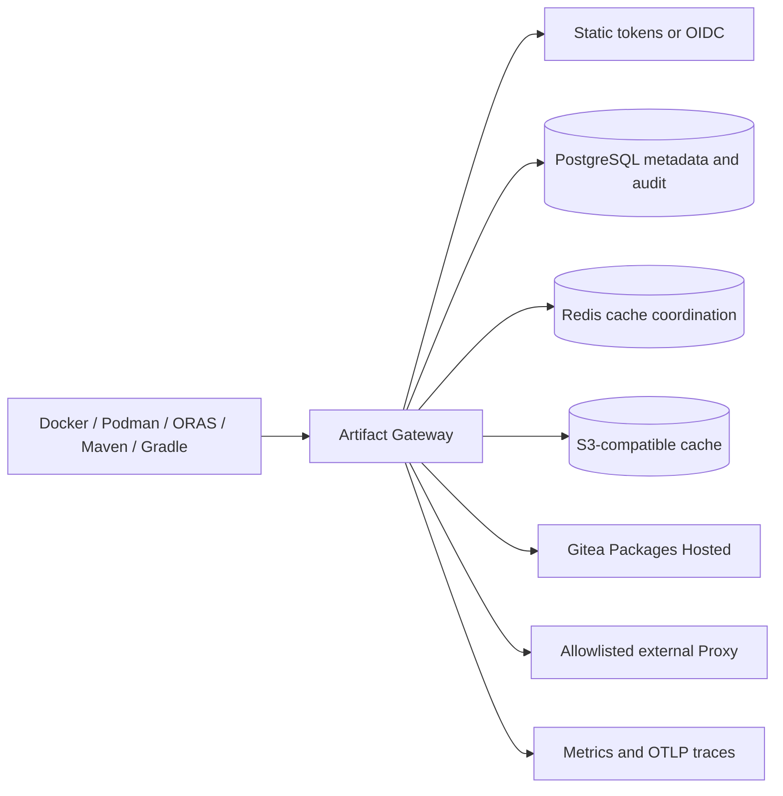

# MVP Release Readiness

This document is the release gate for Artifact Gateway's OCI and Maven MVP.
Run it from a clean checkout on a Docker Desktop workstation with a configured
local `.env`. It uses the real local Gitea fixture seeded from `busybox:1.36`,
but does not require any production credentials.

```sh
make release-readiness
```

The command runs the OCI and Maven black-box clients, an OCI cache performance
gate, and an isolated upgrade/rollback rehearsal. It then verifies object
storage and PostgreSQL readiness failures, recovery after each dependency is
restored, the administrator cache-maintenance view, and static resolver-token
rotation. `scripts/release-readiness.sh` restores the configured resolver token
before it exits, including after a failed check. Record the command output,
Git revision, operator, UTC start/end, and any deviation in the release record.

## Release Checklist

- [ ] `make test`, `make integration-test`, and `make release-readiness` pass.
- [ ] The local Gitea fixture was freshly seeded and its minimal package token
      was used by the Gateway; no Gitea administrator token is used for reads.
- [ ] OCI pull uses the required standard client. Docker is the default;
      run `OCI_E2E_CLIENT=podman make oci-e2e` or
      `OCI_E2E_CLIENT=oras make oci-e2e` where those clients are in scope.
      Maven first-read uses Maven and cached resolution after upstream outage
      uses Gradle.
- [ ] `/readyz` returns `503` while MinIO or PostgreSQL is stopped and `204`
      after each is restored.
- [ ] Cache collection is administrator-only and a release run triggers one
      collection, verifies the successful-run count, and records its state.
      Its deterministic retention behavior is covered by
      `internal/app/cache_maintenance_test.go`.
- [ ] Resolver-token rotation rejects an OCI bearer token issued by the old
      token and permits a newly issued token.
- [ ] The cached OCI manifest performance gate completes 50 requests at
      concurrency 10 with zero errors and p95 latency at or below one second.
      Override only with an approved release record using
      `GATEWAY_PERFORMANCE_REQUESTS`, `GATEWAY_PERFORMANCE_CONCURRENCY`,
      `GATEWAY_PERFORMANCE_P95_MS`, and `GATEWAY_PERFORMANCE_MAX_ERROR_PERCENT`.
- [ ] The upgrade gate deploys `GATEWAY_UPGRADE_FROM_REF` (default `0d1d3f8`)
      into fresh isolated volumes, migrates it to the current checkout, repeats
      OCI and Maven/Gradle client reads, then starts the prior revision against
      those volumes and verifies the persisted OCI Group can still be read.
- [ ] Back up PostgreSQL and MinIO with `make backup-drill`; rehearse restore
      using [the recovery runbook](recovery-runbook.md) before a production
      rollout.
- [ ] Review `/metrics`, `/api/v1/audits`, cache capacity, configured upstream
      allowlists, repository-reader grants, quotas, and OIDC issuer/audience.

## Default Operating Policy

| Area | MVP default |
| --- | --- |
| Hosted source | Gitea Packages through its OCI and Maven HTTP APIs only |
| External Proxy | Disabled unless the exact upstream host is in the protocol allowlist |
| Authentication | Static resolver/admin tokens for local break-glass; HTTPS RS256 OIDC for production identity |
| Authorization | Deny unmatched repository readers when `GATEWAY_REPOSITORY_READERS` is configured |
| OCI cache | Read-through, content-addressed S3 storage; cleanup every five minutes after TTL grace period |
| Maven cache | Component files: 15 minutes; metadata and negative results: one minute |
| Backup target | PostgreSQL metadata plus MinIO object data; 24-hour RPO, 30-minute RTO drill target |
| OCI performance gate | 50 cached manifest reads, concurrency 10, zero errors, p95 <= 1000 ms |
| Upgrade gate | Previous revision `0d1d3f8`, isolated PostgreSQL/MinIO volumes, current migration, protocol regression, binary rollback |

## Architecture



## Known Limitations

- The MVP supports only OCI and Maven read paths. Publishing, replication,
  deletion workflows, and other package formats are out of scope.
- Static-token rotation revokes issued Gateway bearer tokens only after the
  Gateway is restarted. OIDC token revocation is governed by token expiry and
  the identity provider; JWKS refresh is cached for five minutes.
- Cache collection is asynchronous. An object remains during its configured
  grace period when it may still be referenced by a live index.
- The local Gitea fixture validates integration behavior; it is not an HA,
  load, or multi-region production topology test.

## Rollback

1. Stop traffic to the new Gateway deployment and retain its logs and metrics.
2. Redeploy the last known-good Gateway image with the previous validated
   configuration and secrets. Do not roll back PostgreSQL schema independently:
   migrations are forward-only for this MVP.
3. Wait for `/readyz` to return `204`, then perform an authenticated OCI and
   Maven read against a known artifact.
4. If metadata or cache state is implicated, follow the restore drill in
   [the recovery runbook](recovery-runbook.md), restoring PostgreSQL and MinIO
   together from the same backup set.
5. Rotate any potentially exposed resolver, administrator, Gitea, or object
   storage credentials and record the incident and final validation result.
