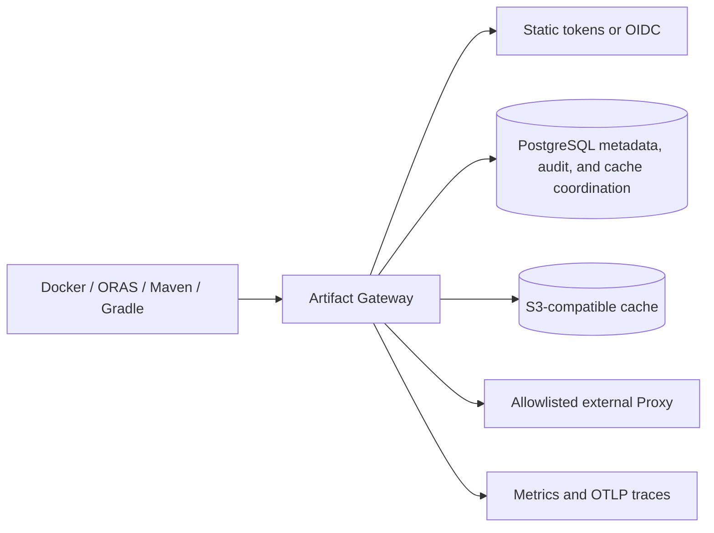

# V2 Release Readiness

This document is the release gate for Artifact Gateway's OCI, Maven, Raw, and
Conan 2 read paths.
Run it from a clean checkout on a Docker Desktop workstation with a configured
local `.env`; it does not require an external package service or production
credentials.

```sh
make integration-test
make native-oci-e2e
make native-raw-e2e
make native-maven-e2e
make conan-e2e
make readiness-e2e
make resolver-rotation-e2e
make oci-performance-e2e
make cache-operations-e2e
make openapi-check
make console-typecheck
make console-build
make console-e2e
make upgrade-readiness
make backup-restore-readiness
```

The commands exercise native protocol fixtures, persistent metadata, dependency
readiness, token rotation, performance, Console contract/build/browser behavior,
upgrade, and restore behavior. Record
their output, Git revision, operator, UTC start/end, and any deviation in the
[release record](release-record-template.md). Do not include bearer tokens,
storage credentials, or unredacted upstream URLs in that record.

## Release Checklist

- [ ] `make test`, `make integration-test`, `make native-oci-e2e`,
      `make native-raw-e2e`, `make native-maven-e2e`, and `make conan-e2e`
      pass.
- [ ] OCI publish/pull semantics pass through the native OCI fixture. Maven
      publish and resolution pass through the native Maven fixture.
      Raw HTTP covers live-Gateway public GET/HEAD/range, anonymous allow and
      denial, canonical-path rejection, negative cache, Proxy allowlist denial,
      source-outage cache recovery, audit, and metrics. Conan 2.21.0 covers the v2
      handshake, revisioned recipe/package downloads, cache, checksum failure,
      anonymous policy, and Proxy allowlist denial.
- [ ] `make readiness-e2e` verifies `/readyz` returns `503` while MinIO or
      PostgreSQL is stopped and `204` after each is restored.
- [ ] `make cache-operations-e2e` verifies cache collection is administrator-only,
      succeeds for an administrator, and increases the successful-run count.
      Its deterministic retention behavior is covered by
      `internal/app/cache_maintenance_test.go`.
- [ ] `make openapi-check`, `make console-typecheck`, `make console-build`,
      and `make console-e2e` verify the generated `/api/v2` management
      client, the Console production build, and the browser flow that reads and
      triggers the administrator-only `/api/v1/operations/cache` surface.
- [ ] Maven retention maintenance runs outside request handling, preserves the
      configured newest versions per module, and tombstones only expired excess
      coordinates before the Maven orphan collector reclaims bytes.
- [ ] `make resolver-rotation-e2e` rejects an OCI bearer token issued by the
      old resolver token after Gateway restart and permits a newly issued token.
- [ ] `make oci-performance-e2e` completes cached OCI manifest reads with the
      default 50 requests at concurrency 10, zero errors, and p95 latency at or
      below one second. Override only with an approved release record using
      `GATEWAY_PERFORMANCE_REQUESTS`, `GATEWAY_PERFORMANCE_CONCURRENCY`,
      `GATEWAY_PERFORMANCE_P95_MS`, and `GATEWAY_PERFORMANCE_MAX_ERROR_PERCENT`.
- [ ] `make upgrade-readiness` deploys `GATEWAY_UPGRADE_FROM_REF` (default
      `0d1d3f8`) into fresh isolated volumes, migrates it to the current
      checkout, verifies the persisted OCI/Maven Groups, creates current
      Raw/Conan Group state, then starts the prior revision against those
      volumes and verifies the persisted OCI Group can still be read. V2
      migrations are additive: a rollback binary must not need V2 rows to
      serve existing OCI Groups.
- [ ] `make backup-restore-readiness` runs PostgreSQL and MinIO backup/restore
      against isolated volumes, verifies restored Raw cache content, Conan
      Group state, Repository grant version/content, and authorization-denial
      audit records. It verifies the same Native Raw object remains denied to
      an authenticated principal without a grant and readable by the granted
      principal. Run `make backup-drill` against the release environment only
      after the isolated rehearsal passes.
- [ ] Review `/metrics`, `/api/v1/audits`, cache capacity, configured upstream
      allowlists, Repository grant sets, quotas, and OIDC issuer/audience. For
      a grant rollout, review the bounded authorization signal without adding
      actor or Repository labels:

      ```promql
      sum by (format, authorization_reason) (
        increase(artifact_gateway_repository_authorization_denials_total[15m])
      )
      ```

## Default Operating Policy

| Area | MVP default |
| --- | --- |
| Hosted source | Native PostgreSQL metadata and MinIO-compatible object bytes |
| External Proxy | Disabled unless the exact upstream host is in the protocol allowlist |
| Authentication | Static resolver/admin tokens for local break-glass; HTTPS RS256 OIDC for production identity |
| Authorization | Deny unmatched repository readers when `GATEWAY_REPOSITORY_READERS` is configured |
| OCI cache | Read-through, content-addressed S3 storage; cleanup every five minutes after TTL grace period |
| Maven cache | Component files: 15 minutes; metadata and negative results: one minute |
| Backup target | PostgreSQL metadata plus MinIO object data; 24-hour RPO, 30-minute RTO drill target |
| OCI performance gate | 50 cached manifest reads, concurrency 10, zero errors, p95 <= 1000 ms |
| Cache operations gate | Resolver denied; administrator collection increases successful-run count |
| Upgrade gate | Previous revision `0d1d3f8`, isolated PostgreSQL/MinIO volumes, current migration, protocol regression, binary rollback |

## Architecture



## Known Limitations

- V2 supports OCI, Maven, Raw, and Conan 2 read paths. Publishing, replication,
  deletion workflows, directory listing, and package formats beyond those four
  are out of scope.
- Raw uses HTTP GET/HEAD only, supports a single byte range, and does not
  generate or reconcile checksum sidecars. Conan supports only Conan 2 v2 REST
  reads; Conan 1, uploads, deletes, copies, and general search are unsupported.
- Static-token rotation revokes issued Gateway bearer tokens only after the
  Gateway is restarted. OIDC token revocation is governed by token expiry and
  the identity provider; JWKS refresh is cached for five minutes.
- Cache collection is asynchronous. An object remains during its configured
  grace period when it may still be referenced by a live index.

## Rollback

1. Stop traffic to the new Gateway deployment and retain its logs and metrics.
2. Redeploy the last known-good Gateway image with the previous validated
   configuration and secrets. Do not roll back PostgreSQL schema independently:
   migrations are forward-only for this MVP.
3. Wait for `/readyz` to return `204`, then perform an authenticated OCI and
   Maven read against a known artifact.
4. If metadata or cache state is implicated, follow the restore drill in
   [the recovery runbook](recovery-runbook.md), restoring PostgreSQL and MinIO
   together from the same backup set. Confirm an OCI/Maven read and, where V2
   state was affected, a Raw GET and Conan 2 revision read before reopening
   traffic. For a managed Repository, confirm a known granted principal can
   read and a separately authenticated, ungranted principal still receives the
   protocol denial; do not remove grants merely to diagnose restoration.
5. Rotate any potentially exposed resolver, administrator, or object
   storage credentials and record the incident and final validation result.

## V2 Anonymous Policy Operations

Anonymous reads are disabled by default. Enable one only after an owner has
approved both switches: set `anonymous: true` on the format Group and on every
member Repository that may serve unauthenticated `GET`/`HEAD`. A false member
switch narrows the Group and keeps that member's cache and upstream inaccessible
to anonymous requests. Verify the change with an unauthenticated read, the
`actor=anonymous` audit record, and `artifact_gateway_anonymous_reads_total`.

To roll back public access, first set the affected member switches to false,
then the Group switch to false and confirm unauthenticated reads receive the
format challenge. Deploy the prior application only after that policy rollback.
The schema migration is additive and forward-only: do not drop its columns.
If a corrective schema change is required, ship a forward compensating migration
and verify old OCI/Maven reads, Raw/Conan policy denials, and existing audit
queries before restoring traffic.
