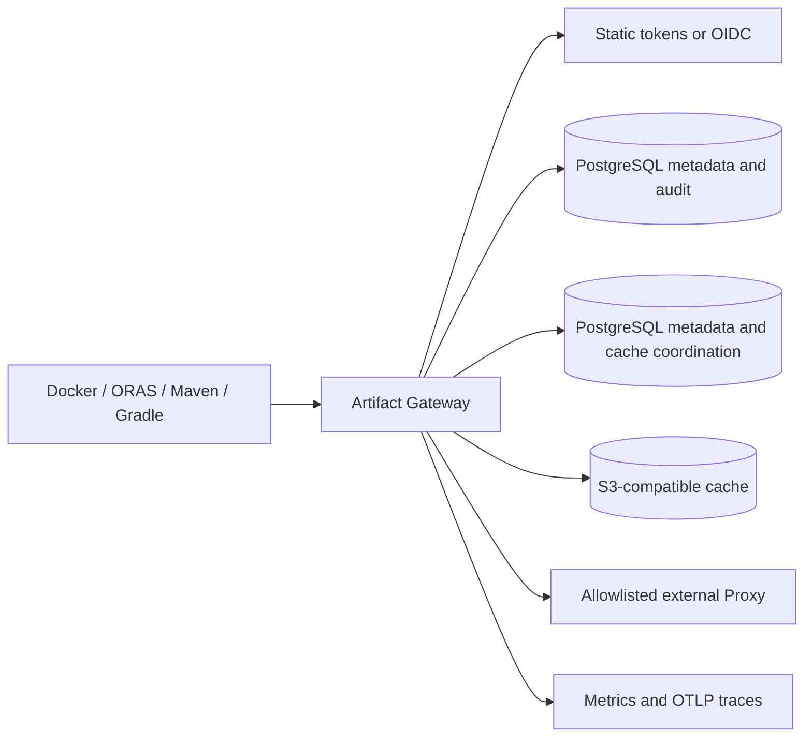

# V2 Release Readiness

This document is the release gate for Artifact Gateway's OCI, Maven, Raw, and
Conan 2 read paths.
Run it from a clean checkout on a Docker Desktop workstation with a configured
local `.env`; it does not require an external package service or production
credentials.

```sh
make integration-test
make native-oci-e2e
make native-raw-e2e
make native-maven-e2e
```

The commands exercise the native protocol fixtures and persistent metadata
store. Record their output, Git revision, operator, UTC start/end, and any
deviation in the release record.

## Release Checklist

- [ ] `make test`, `make integration-test`, `make native-oci-e2e`,
      `make native-raw-e2e`, and `make native-maven-e2e` pass.
- [ ] OCI publish/pull semantics pass through the native OCI fixture. Maven
      publish and resolution pass through the native Maven fixture.
      Raw HTTP covers live-Gateway public GET/HEAD/range, anonymous allow and
      denial, canonical-path rejection, negative cache, Proxy allowlist denial,
      source-outage cache recovery, audit, and metrics. Conan 2.21.0 covers the v2
      handshake, revisioned recipe/package downloads, cache, checksum failure,
      anonymous policy, and Proxy allowlist denial.
- [ ] `/readyz` returns `503` while MinIO or PostgreSQL is stopped and `204`
      after each is restored.
- [ ] Cache collection is administrator-only and a release run triggers one
      collection, verifies the successful-run count, and records its state.
      Its deterministic retention behavior is covered by
      `internal/app/cache_maintenance_test.go`.
- [ ] Resolver-token rotation rejects an OCI bearer token issued by the old
      token and permits a newly issued token.
- [ ] The cached OCI manifest performance gate completes 50 requests at
      concurrency 10 with zero errors and p95 latency at or below one second.
      Override only with an approved release record using
      `GATEWAY_PERFORMANCE_REQUESTS`, `GATEWAY_PERFORMANCE_CONCURRENCY`,
      `GATEWAY_PERFORMANCE_P95_MS`, and `GATEWAY_PERFORMANCE_MAX_ERROR_PERCENT`.
- [ ] The upgrade gate deploys `GATEWAY_UPGRADE_FROM_REF` (default `0d1d3f8`)
      into fresh isolated volumes, migrates it to the current checkout, repeats
      OCI and Maven/Gradle client reads, then starts the prior revision against
      those volumes and verifies the persisted OCI Group can still be read.
      V2 migrations are additive: verify Raw/Conan Group policy, cache, and
      audit rows remain present after upgrade; a rollback binary must not need
      V2 rows to serve existing OCI Groups.
- [ ] `make backup-restore-readiness` runs PostgreSQL and MinIO backup/restore
      against isolated volumes, verifies restored Raw cache content, Conan
      Group state, and both V2 audit formats. Run `make backup-drill` against
      the release environment only after the isolated rehearsal passes.
- [ ] Review `/metrics`, `/api/v1/audits`, cache capacity, configured upstream
      allowlists, repository-reader grants, quotas, and OIDC issuer/audience.

## Default Operating Policy

| Area | MVP default |
| --- | --- |
| Hosted source | Native PostgreSQL metadata and MinIO-compatible object bytes |
| External Proxy | Disabled unless the exact upstream host is in the protocol allowlist |
| Authentication | Static resolver/admin tokens for local break-glass; HTTPS RS256 OIDC for production identity |
| Authorization | Deny unmatched repository readers when `GATEWAY_REPOSITORY_READERS` is configured |
| OCI cache | Read-through, content-addressed S3 storage; cleanup every five minutes after TTL grace period |
| Maven cache | Component files: 15 minutes; metadata and negative results: one minute |
| Backup target | PostgreSQL metadata plus MinIO object data; 24-hour RPO, 30-minute RTO drill target |
| OCI performance gate | 50 cached manifest reads, concurrency 10, zero errors, p95 <= 1000 ms |
| Upgrade gate | Previous revision `0d1d3f8`, isolated PostgreSQL/MinIO volumes, current migration, protocol regression, binary rollback |

## Architecture



## Known Limitations

- V2 supports OCI, Maven, Raw, and Conan 2 read paths. Publishing, replication,
  deletion workflows, directory listing, and package formats beyond those four
  are out of scope.
- Raw uses HTTP GET/HEAD only, supports a single byte range, and does not
  generate or reconcile checksum sidecars. Conan supports only Conan 2 v2 REST
  reads; Conan 1, uploads, deletes, copies, and general search are unsupported.
- Static-token rotation revokes issued Gateway bearer tokens only after the
  Gateway is restarted. OIDC token revocation is governed by token expiry and
  the identity provider; JWKS refresh is cached for five minutes.
- Cache collection is asynchronous. An object remains during its configured
  grace period when it may still be referenced by a live index.

## Rollback

1. Stop traffic to the new Gateway deployment and retain its logs and metrics.
2. Redeploy the last known-good Gateway image with the previous validated
   configuration and secrets. Do not roll back PostgreSQL schema independently:
   migrations are forward-only for this MVP.
3. Wait for `/readyz` to return `204`, then perform an authenticated OCI and
   Maven read against a known artifact.
4. If metadata or cache state is implicated, follow the restore drill in
   [the recovery runbook](recovery-runbook.md), restoring PostgreSQL and MinIO
   together from the same backup set. Confirm an OCI/Maven read and, where V2
   state was affected, a Raw GET and Conan 2 revision read before reopening
   traffic.
5. Rotate any potentially exposed resolver, administrator, or object
   storage credentials and record the incident and final validation result.

## V2 Anonymous Policy Operations

Anonymous reads are disabled by default. Enable one only after an owner has
approved both switches: set `anonymous: true` on the format Group and on every
member Repository that may serve unauthenticated `GET`/`HEAD`. A false member
switch narrows the Group and keeps that member's cache and upstream inaccessible
to anonymous requests. Verify the change with an unauthenticated read, the
`actor=anonymous` audit record, and `artifact_gateway_anonymous_reads_total`.

To roll back public access, first set the affected member switches to false,
then the Group switch to false and confirm unauthenticated reads receive the
format challenge. Deploy the prior application only after that policy rollback.
The schema migration is additive and forward-only: do not drop its columns.
If a corrective schema change is required, ship a forward compensating migration
and verify old OCI/Maven reads, Raw/Conan policy denials, and existing audit
queries before restoring traffic.
