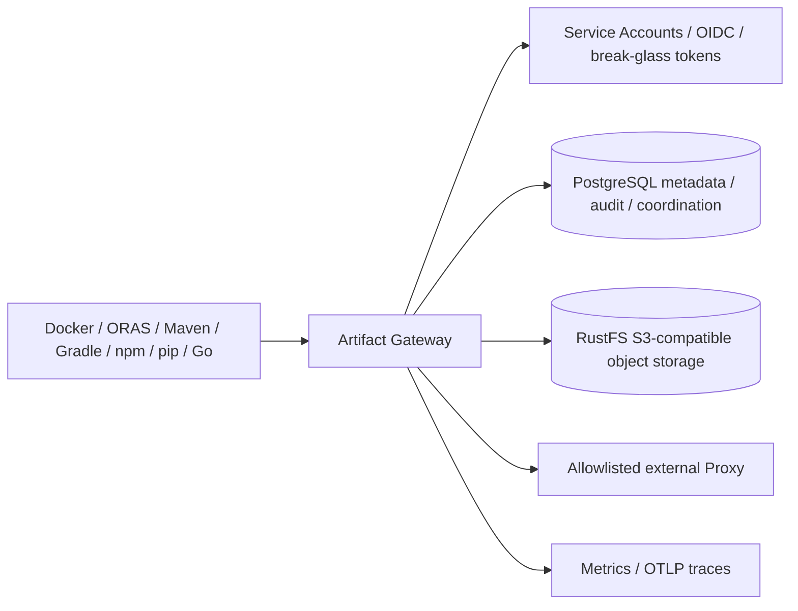

# Artifact Gateway 0.1.x 受控部署就绪

[English](release-readiness.md) | [文档索引](README.zh-CN.md)

本文是 Artifact Gateway 0.1.x 获批进入特定受控环境前的附加证据门禁，范围有意大于
GitHub Tag Release 门禁：`v0.1.0` 要求来自干净 `main` 提交，且 CI、主线制品与不可变
镜像候选全部成功；本文还覆盖目标环境相关的运维、性能、升级与恢复。GitHub Release
成功并不代表已经针对生产目标执行完本清单。

本套件覆盖 OCI、Maven、Raw、Conan、npm、PyPI 的 Hosted/Proxy 生命周期与分发，以及
Go Module 原子 Hosted 发布和 Hosted/Proxy/Group 读取。

门禁还通过真实 Debian 客户端和签名快照恢复演练覆盖未公开的 APT Hosted 预览；通过不等于把 APT Hosted 纳入 0.1.0 兼容声明。

从干净 checkout、配置本地 `.env` 的 Docker Desktop 工作站执行，无需外部包服务或生产凭证：

```sh
make integration-test
make test
make native-oci-e2e
make native-raw-e2e
make native-maven-e2e
make native-npm-e2e
make native-pypi-e2e
make native-go-e2e
make native-apt-e2e
make apt-signer-rotation-e2e
make cargo-contract
make conan-e2e
make readiness-e2e
make resolver-rotation-e2e
make service-account-rotation-e2e
make oci-performance-e2e
make cache-operations-e2e
make openapi-check
make console-typecheck
make console-check
make console-test
make console-build
make console-e2e
make upgrade-readiness
make backup-restore-readiness
```

`make test` 包含隔离的 `dev/dev-status/dev-down` CLI 边界。把输出、Git revision、operator、UTC 起止和偏差写入[发布记录](release-record-template.zh-CN.md)，不得记录 Bearer、存储凭证或未脱敏上游 URL。

## 受控部署清单

- [ ] 上述 test、integration、各 native E2E、APT signer rotation、Cargo contract 和 Conan E2E 全部通过。
- [ ] Integration 包含 PostgreSQL/RustFS 中 OCI、Maven、Raw、Conan 晋级和断点复制证据，验证对象发布、retry/resume 与 SHA-256；迁移执行两次证明第二次 no-op，并拒绝已应用文件 checksum drift。
- [ ] OCI 真实 publish/pull；Maven 真实 publish/resolve；npm 真实 Hosted/Proxy/Group、离线上游重放；PyPI 真实 twine/pip；Go Hosted 发布与 `go mod download`、Proxy 离线 cache replay 全部通过。
- [ ] APT 预览构建真实 `.deb`，发布/安装签名快照，捕获签名、索引和包 digest，备份 PostgreSQL/RustFS，发布后续快照后恢复原快照，并在 signer 离线时再次安装。
- [ ] Raw 黑盒覆盖 public GET/HEAD/Range、匿名 allow/deny、canonical path、negative cache、Proxy allowlist、上游中断 cache 恢复、Audit 和 metric；Conan 2.21.0 覆盖 handshake、revision recipe/package、cache、checksum failure、匿名和 allowlist。
- [ ] `readiness-e2e` 在 RustFS/PostgreSQL 停止时 `/readyz=503`，恢复后为 `204`。
- [ ] `cache-operations-e2e` 证明 collection 仅管理员可用、执行成功且成功计数增加；确定性 retention 由单测覆盖。
- [ ] OpenAPI 和 Console typecheck/lint/format/accessibility/component/coverage/build/browser 门禁通过，并经 Console proxy 完成管理员 Dashboard session。
- [ ] Maven retention 在请求外执行，保留每 module 的最新版本，只逻辑删除过期多余 coordinate，再由 collector 回收。
- [ ] Resolver rotation 在重启后拒绝旧 Token 派生的 OCI bearer，并允许新 Token。
- [ ] Service Account rotation 证明稳定 Grant 下新旧 credential 重叠、只撤销旧值、禁用账户后拒绝剩余值。
- [ ] OCI performance 默认 50 次缓存 manifest、并发 10、零错误、p95 ≤1 秒。任何覆盖必须写入已批准发布记录。
- [ ] Upgrade 从默认 revision `324aba95` 在隔离 volume 部署，迁移到当前版本并保留 PostgreSQL/RustFS、Maven/OCI/Group/Go Proxy；再用旧版本回滚并前滚，证明加法迁移和协议兼容。项目不再提供 legacy object-store 迁移路径。
- [ ] 迁移 `000095` 前停止新 replication，drain 所有旧 plan 并停止旧 Worker；迁移后只启动新 Worker，再开放 replication/quarantine。每个当前 plan 必须 coordinate 和 digest 同时存在，旧空身份 plan 由新 Worker 失败关闭。
- [ ] Backup/restore 使用隔离 volume，通过 HTTP 创建 OCI、Maven、Raw、Conan、Go 源 Artifact，创建/重放晋级和复制，恢复后验证指令与 Audit。Go 前后运行真实下载并校验三表示 digest，证明备份后 mutation 不存在。
- [ ] 恢复还验证 Raw cache、Quarantine state/reason、Conan Group、Grant version/content 和 Native Raw deny/allow。隔离 rehearsal 通过后才可对发布环境运行 `make backup-drill`。
- [ ] `native-apt-e2e` 证明 signing-state、Release、两份签名、direct/by-hash index 与 package byte 在恢复后精确一致；signer key volume 明确不属于此证明。
- [ ] `apt-signer-rotation-e2e` 使用 signer-owned 只读私钥 volume 和 CA 验证 HTTPS，证明 Debian client 在 old、overlap、new 阶段行为，并证明旧 key-only client 明确拒绝新快照。
- [ ] 检查 `/metrics`、Audit、capacity、allowlist、Grant、quota、OIDC issuer/audience。授权拒绝与后台队列使用有界聚合，不增加 actor/Repository label。

建议检查：

```promql
sum by (format, authorization_reason) (
  increase(artifact_gateway_repository_authorization_denials_total[15m])
)

sum by (kind, format, state) (
  artifact_gateway_background_jobs{state=~"pending|retrying"}
)
max by (kind, format) (
  artifact_gateway_background_queue_oldest_actionable_age_seconds
)
```

## 默认运维策略

| 区域 | MVP 默认 |
| --- | --- |
| Hosted 来源 | PostgreSQL 权威 metadata + RustFS S3-compatible byte |
| 外部 Proxy | 精确上游 host 未进入 allowlist 时禁用 |
| 认证 | CI/app 使用可轮换 Service Account；生产人类身份用 HTTPS RS256 OIDC；静态 Token 只作本地 break-glass |
| 授权 | 配置 reader policy 后拒绝未匹配 principal |
| OCI cache | 按内容 read-through，TTL 宽限后每五分钟清理 |
| Maven cache | component 15m，metadata 与 negative 1m |
| 备份 | PostgreSQL + RustFS；演练目标 RPO 24h、RTO 30m |
| OCI 性能 | 50 请求、并发 10、0 错误、p95 ≤1000ms |
| Cache 运维 | Resolver 被拒，Admin collection 增加成功计数 |
| Upgrade | previous RustFS revision `324aba95`，隔离 volume、当前迁移、协议回归与二进制回滚 |

## 架构



## 已知限制

- V1 生命周期覆盖 OCI、Maven、Raw、Conan、npm、PyPI、Go；晋级复制均发布已验证 Artifact。Go 把 info/mod/zip 作为一个快照、拒绝 Proxy 目标并在 Worker 发布前复查隔离。恢复 rehearsal 保留任务和 plan，但不要求恢复后 Worker 完成它们。
- Raw Hosted 支持认证 PUT/DELETE、单 Range GET/HEAD、派生 checksum 与 resumable upload；不支持条件更新和非 HTTP 客户端工具。Conan 支持 Conan 2 Hosted、revision delete/restore、Group/Proxy、晋级复制；不支持 Conan 1、remote copy 或通用上游 index aggregation。
- 静态 Token 轮换只有 Gateway 重启后才撤销已签发 bearer。OIDC 撤销服从 Token expiry/IdP，JWKS 缓存五分钟。
- Cache collection 异步；宽限期内对象可能仍被活跃 index 引用。

## 回滚

1. 停止新 Gateway 流量并保留日志/指标。
2. 使用之前验证过的 image、配置和 secret 重新部署；不得独立回滚 PostgreSQL schema，迁移仅向前。
3. 等 `/readyz=204`，执行已知 OCI/Maven 认证读取。
4. 若涉及 metadata/cache，按[恢复手册](recovery-runbook.zh-CN.md)从同一备份集同时恢复 PostgreSQL/RustFS。V2 受影响时再验证 Raw GET 与 Conan revision；已管理 Repository 同时验证一个 granted principal 成功和另一个 ungranted principal 被拒绝，不要为诊断删除 Grant。
5. 轮换可能暴露的 resolver、admin、object-store credential，并记录事件与最终验证。

## V2 匿名策略运维

匿名默认关闭。只有 owner 批准全局与目标双重开关后，才在 Group 和每个允许匿名服务的 member Repository 开启。任一 member false 会将其及其 cache/upstream 排除。

使用未认证读取、`actor=anonymous` Audit 和匿名指标验证。回滚时先关闭成员，再关闭 Group 并确认返回协议 challenge；之后才可回滚应用。Schema 字段为增量且仅向前，不得删除；需要修正时使用前向补偿迁移并复验旧协议、策略拒绝和 Audit query。
