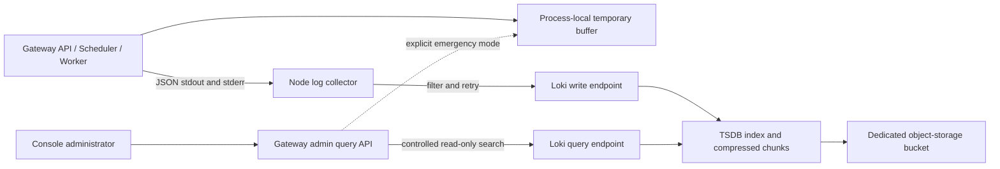

# Runtime log product design (proposal)

[简体中文](runtime-log-product-design.zh-CN.md) | [Current logging behavior](runtime-logging.md) | [Documentation index](README.md)

> Status: design proposal dated 2026-09-30, tracking [#151](https://github.com/ccsert/artifact-gateway/issues/151) and [#152](https://github.com/ccsert/artifact-gateway/issues/152). Shared collection, durable storage, and cluster search described here have not been implemented or deployed. Local previews and CI do not satisfy those issues' deployment acceptance criteria.

## 1. User problem and scope

A platform administrator needs one place to identify **which Gateway API or Worker node failed, what happened within a request or job, and whether the evidence remains after a restart**. Runtime logs support troubleshooting; audit records remain operation evidence. Request IDs, Trace IDs, and job IDs connect the two, but they have separate storage and retention policies.

This phase covers application runtime events from Gateway API, Scheduler, and Worker processes, including dedicated Worker nodes. PostgreSQL, RustFS, host operating system, and other applications remain in the deployment platform's observability system. Only platform administrators can use the Console log search.

Current code evidence: `internal/operationalog/logger.go` emits one JSON object per line; `cmd/gateway/main.go` writes to stdout and an optional process-local buffer; `internal/app/runtime_logs_api.go` queries only that buffer; `compose.yml` rotates Gateway Docker `json-file` logs. The existing `GET /api/v2/runtime/logs` response has `scope=local` and a process-local `beforeSequence` cursor. Neither represents retained cluster history.

## 2. Console experience

The entry remains **System runtime → Runtime logs**. It initially searches the last hour across API and Worker events at every level, newest first. The page has a compact filter bar, source and collection status, and a log list. It does not devote a large Alert to static copy or use numbered pages for an append-only stream.

| User action | Expected behavior |
| --- | --- |
| Open from an audit record | Prefill Request ID / Trace ID and a window spanning 15 minutes on either side of the record; the correlation filters can be cleared. |
| Open from a job or Webhook delivery | Search Worker events by job/delivery ID and show Worker as the source. |
| Investigate a fault | Presets for 15 minutes, 1 hour, 6 hours, and 24 hours; combine source, node, level, component, and literal keyword filters. Select nodes from the runtime node list instead of memorizing instance IDs. |
| Inspect an entry | Show millisecond time, level, API/Worker source, node, component, and summary. Expand to allowlisted attributes, correlation IDs, a copy action for redacted JSON, and an audit link. Long messages collapse and controls work by keyboard. |
| Read older entries | An opaque-cursor “Load older logs” action appends results. Freeze the first query's end time; new entries appear only after Refresh. Hide the action when no older entries exist. |

The page distinguishes **collector not configured**, **collection/query failure**, **loading**, **genuinely empty results**, **outside retention**, and **delayed or partial collection**. It labels results as `Cluster logs` or `Current-node temporary logs` and shows the query cut-off time, retention window, and collection state. It never displays an uncomputed “total log count.” On backend failure it retains already loaded results with a stale marker; it does not silently fall back to the local buffer.

The first phase allows copying one redacted entry and sharing a link with non-sensitive filters. Keywords are excluded from shared URLs. Bulk export, live tailing, saved searches, and alert rules are later designs because each adds an unbounded read or authorization surface.

On desktop, use a dense list with expandable rows. The primary filter row contains time presets and `RangePicker`, source, level, keyword, and Search; node, component, and Request/Trace IDs live under More filters. Each row initially shows time, level, source, node, and message; expansion reveals structured fields and copy. At narrow widths, rows become a single column without horizontal filter-table scrolling. Show time in the user's timezone and preserve UTC in copied JSON. Reuse Ant Design inputs/filter controls and the Console cursor-load component. Reserve Alert for actionable failures, not static explanatory copy.

## 3. Three kinds of log separation

1. **Logical classification:** stable `source=api|scheduler|worker`, `eventKind=access|task|dependency|lifecycle|system`, `level`, and `component` fields. Each event declares its source even when one process hosts several roles. HTTP access logs remain limited to 5xx and slow requests by default; `GATEWAY_ACCESS_LOG=full` is an explicit diagnostic switch and does not change audit records.
2. **Event boundaries:** one event is one UTF-8 JSON line. Stack traces are escaped structured fields rather than separate lines. The proposed limit is 16 KiB per event; preserve essential fields, truncate long text with `truncated=true`, and count truncations. The current local buffer discards lines over 16 KiB, so the implementation must align behavior instead of silently losing critical failures.
3. **Physical rotation and chunks:** container/node rotation is only a short emergency buffer. The shared backend compresses entries into stream chunks and deletes indexes and chunks according to retention. The product does not invent daily files, database partitions, or one object per request. Compose's current `10m × 5` setting is per-container emergency capacity, not a promise of 50 MiB of cluster history; Kubernetes node rotation is likewise not historical search.

Full access logging may be enabled only for an audited, time-limited diagnostic window, proposed to expire within 60 minutes and restore `limited`. The existing static environment variable has no such guard; implementation must add one or require a timed deployment rollback. DEBUG events stay off by default. Classification therefore also controls volume rather than merely grouping the UI.

Extend the existing `time`, `level`, `msg`, `instanceId`, `sessionId`, `component`, `operation`, `requestId`, and `traceId` schema with `schemaVersion`, `eventId`, `source`, `eventKind`, and `deployment`. `eventId` supports retry deduplication and page boundaries. HTTP method, **route template**, status, duration, and Worker job ID are optional structured fields. Represent dependency failures with a safe `errorCode`, dependency name, and stage instead of emitting raw error objects. Never emit raw URLs, request bodies, credentials, or sensitive headers. The platform may collect raw stderr, but unparsed or unredacted lines go to a restricted `unparsed` stream and are not returned to the Console until normalized.

## 4. Collection, storage, and retention



The recommended first shared backend is **Loki with Grafana Alloy**. Gateway implements a controlled query adapter; browsers never connect to Loki. Loki can store its TSDB index and compressed chunks in object storage, while its Compactor enforces retention. Do not use Request ID, Trace ID, `eventId`, `instanceId`, or `sessionId` as high-cardinality index labels; keep them in JSON or structured metadata. Begin with environment, service, and event source labels. Keep level and component as structured fields unless measured queries justify promoting them. See the official [label guidance](https://grafana.com/docs/loki/latest/get-started/labels/), [storage documentation](https://grafana.com/docs/loki/latest/configure/storage/), and [retention documentation](https://grafana.com/docs/loki/latest/operations/storage/retention/).

If the deployment platform already has centralized logging, prefer its collection and retention, provided it can satisfy the same Gateway query contract and acceptance tests. Loki is the baseline first adapter. No shared collector configuration was found in this repository; that does not prove an external platform has none.

| Option | Trade-off |
| --- | --- |
| Reuse an existing platform | Avoids new storage operations but requires a Gateway adapter and evidence for permissions, retention, and cross-node queries. Prefer it when available. |
| Loki + Alloy | Provides established collection, compressed chunks, retention, and time search; introduces a separately operated service. It is the first adapter that this repository can verify. |
| Build an index on PostgreSQL + RustFS | Appears to reduce services but requires custom high-volume ingest, indexes, paging, deletion, and recovery, competing with the business database. Excluded from the first phase. |
| Current process buffer | Dependency-free emergency view; restart clears it and nodes cannot share it. It cannot satisfy historical search. |

| Environment | Recommended deployment |
| --- | --- |
| Single-machine development/demo | Optional single-binary Loki and Alloy with a persistent volume, only to prove functionality. Collecting Docker logs in Compose requires a Docker socket permission review; do not widen Gateway container privileges by default. |
| Kubernetes/production | Platform-managed Alloy node collection of targeted API/Worker Pods; Loki with a separate controlled object-storage bucket and persistent WAL/Compactor working directories. Separate write and query network paths and credentials. |
| Existing log platform | Keep the platform's collection and retention; add a compatible read-only Gateway adapter. The Console never exposes a vendor query language. |

Production log storage should preferably have a **failure domain independent** of artifact-byte storage, so a RustFS outage does not also hide its diagnostics. If an S3-compatible cluster is reused after review, it needs a separate bucket, quota, credentials, retention, and a tested correlated-failure plan. High-volume logs do not enter Gateway business PostgreSQL tables or share audit retention.

The proposed initial retention is **14 days, configurable by deployment**. Queries before the retained window say so explicitly; storage is never silently indefinite. Loki Compactor retention must be enabled and actual deletion verified. Object-store lifecycle must not expire objects before Loki retention. Level-based tiers or longer retention wait for measured volume and cost. Start capacity planning with `events/second × average bytes/line × 86400 × retention days` as an uncompressed baseline, then size with measured compression, peaks, and replicas. This proposal does not assume current traffic.

Collectors persist read positions and retry. **This is not a zero-loss promise:** local rotation may overtake an offline collector; backend rate limits and full disks also create gaps. Alert on Alloy `loki.write` retry and drop metrics. Its remote-write WAL is still marked experimental in the official documentation and is not a default durability guarantee. Inject a short backend outage during acceptance and reconcile event counts and gap signals. See [Alloy Docker collection](https://grafana.com/docs/alloy/latest/reference/components/loki/loki.source.docker/) and [write metrics/WAL status](https://grafana.com/docs/alloy/latest/reference/components/loki/loki.write/).

## 5. Query contract and pagination

Keep `GET /api/v2/runtime/logs` as the explicitly marked `scope=local` emergency API. Add `POST /api/v2/runtime/logs/search` for cluster search so the old endpoint's semantics do not change silently and keywords do not enter URLs. Add `GET /api/v2/runtime/logs/capabilities` to return configuration, availability, retention window, ingestion lag, and supported filters without exposing backend addresses or credentials.

Proposed request and response shapes follow; the implementation's OpenAPI will be authoritative:

```json
{
  "from": "2026-09-30T03:00:00Z",
  "to": "2026-09-30T04:00:00Z",
  "sources": ["api", "worker"],
  "requestId": "req-123",
  "limit": 50
}
```

```json
{
  "scope": "cluster",
  "asOf": "2026-09-30T04:00:00Z",
  "items": [{
    "eventId": "evt-123",
    "time": "2026-09-30T03:12:00Z",
    "level": "ERROR",
    "source": "worker",
    "instanceId": "worker-01",
    "message": "task failed",
    "requestId": "req-123"
  }],
  "nextCursor": null,
  "hasMore": false,
  "partial": false,
  "collection": {
    "state": "healthy",
    "lastHeartbeatAt": "2026-09-30T03:59:30Z"
  }
}
```

A cluster request contains `from`, `to`, `sources`, `levels`, `instanceIds`, `components`, `requestId`, `traceId`, `keyword`, `limit`, and `cursor`. Defaults: one hour and 50 entries. Hard cap: 100 per page and **24 hours per query**, always within configured retention; proposed server timeout 5 seconds and per-admin rate limiting. An administrator can select any day in the 14-day retention window; audit/job links provide a precise time anchor. An ID search spanning the whole retention window without a time anchor is not promised in phase one: Loki does not index high-cardinality IDs and could scan too many chunks. Add segmented search only if capacity tests support it. Gateway builds backend queries from allowlisted fields and rejects raw LogQL, regex, and arbitrary label selectors. Loki `query_range` supports time bounds, reverse order, and result limits, but Gateway must enforce its own product limits. See the [Loki query API](https://grafana.com/docs/enterprise-logs/latest/reference/loki-http-api/) and [query acceleration limitations](https://grafana.com/docs/loki/latest/query/query_acceleration/).

The response contains normalized redacted entries, `scope=cluster`, a fixed `asOf` query cut-off, `nextCursor`, `hasMore`, collection status, and `partial`. The cursor is opaque, signed, short-lived, and bound to filters plus `asOf`; it is neither a page number nor the process-local `sequence`. Order by time descending, deduplicate same-timestamp entries by `eventId`, and handle overlapping page boundaries. If backend limits prevent a complete boundary fetch, return `partial` and ask for a narrower window instead of silently skipping entries. Refresh begins a new time window and never mixes its results with old pages.

Error semantics: `503 log_backend_not_configured`, `503 log_backend_unavailable`, `504 log_query_timeout`, `400` for invalid filters/range, `403` for insufficient permission, and `429` for rate limiting. An empty result is `200 items=[]`, separate from every failure state. Failure never silently falls back to `scope=local`; an administrator can explicitly select “Current-node temporary logs.”

## 6. Security, privacy, and operational signals

- Check platform-administrator authorization on every Gateway query. Fix and TLS-validate the backend address server-side; keep write and query credentials separate in Secrets. Loki is not exposed directly to browsers or public networks. Its HTTP API has no built-in authorization boundary, so deployment must provide network and authentication controls. See the [official API documentation](https://grafana.com/docs/enterprise-logs/latest/reference/loki-http-api/).
- Apply field allowlists and redaction at the source, then defensive masking at collection and query response. The current `redactAttribute` masks by **attribute name**; it does not prove arbitrary `msg` text is safe. Before rollout, add canary tests for realistic tokens, Cookies, URL query secrets, error text, and job arguments. Detail and copy views use the same redacted data.
- Audit searches by actor, time window, source, correlation IDs, result count, and status. Do not audit raw keywords, backend credentials, or log bodies. Search auditing must not create an unbounded access-log loop.
- Expose collector read positions, send failures/drops, ingest rejection, storage use, query latency, retention execution, and **last heartbeat for each expected node**. Every runtime process emits a periodic non-sensitive heartbeat so the product can distinguish quiet traffic from broken collection. The page shows lag/gaps instead of a deceptively empty list.
- Cover the separate log bucket, index/WAL, and snapshots in deletion and backup policy. Runtime logs expire according to their policy; audit records follow their own policy. Bucket versioning or backups must not silently extend promised log retention.

## 7. Delivery and acceptance

1. **#151: producers and collection.** Add `eventId/source/eventKind`, safe truncation, and redaction tests. Verify API/Worker stdout/stderr collection, position recovery, separate storage, retention deletion, short backend outage, and gap metrics in Compose and Kubernetes. Measure actual log volume first.
2. **#152: search and experience.** Define OpenAPI before implementing the read-only cluster adapter, capability status, cursor, permission/rate/time limits, and Console source labels, filters, detail view, correlation links, distinct empty/error/expired states, and explicit local emergency mode.
3. **Deployment acceptance.** Use at least two API nodes and one dedicated Worker. Emit identifiable request and job events, query across nodes, and read them again after API/Worker Pod restarts. Exercise 403/429/503/504, canary-secret masking, same-timestamp pagination without misses or duplicates, configured 14-day retention/deletion, and collector outage recovery. CI and single-node Compose do not replace this test.

Proposed initial load-test targets, subject to actual traffic and budget: P95 at most 3 seconds for a recent one-hour query scoped by time and source, under the five-second hard timeout; P95 normal ingestion lag at most 60 seconds, with page and monitoring alerts when an expected node has no heartbeat for five minutes; reconcile every event after a five-minute collector-backend outage at measured baseline load, with no silent drop; verify deletion and falling object-storage usage within 24 hours after the retention threshold. These are **acceptance targets**, not claims about current performance or durability.

Roll out in order: mirror collection and compare with stdout → enable cluster search in a controlled environment → make cluster search the Console default → close #151/#152 only after multi-node/restart acceptance. Rollback disables cluster search while retaining stdout and the explicit local emergency API; existing audit data remains intact.

## 8. Values to validate with measurements

The 14-day retention, 16 KiB event limit, 5-second timeout, and 24-hour per-query range are **proposed defaults**, not deployed settings. Before implementation, determine whether the platform has an existing collector, actual average/peak volume, independent object-storage failure domains, required retention, and cost budget. Tune values from measurements without changing the API and Console product semantics.
