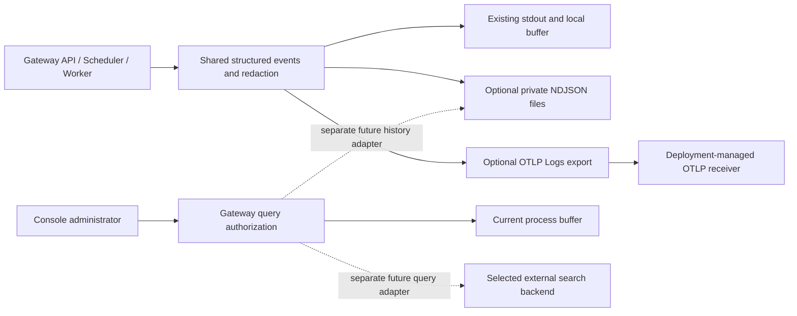

# Runtime log outputs and history design

[简体中文](runtime-log-product-design.zh-CN.md) | [Current logging behavior](runtime-logging.md) | [Documentation index](README.md)

> Status: output direction agreed on 2026-10-01: optional **files and OTLP Logs**, with stdout preserved. This document separates that direction from the remaining history/query decisions tracked by [#151](https://github.com/ccsert/artifact-gateway/issues/151) and [#152](https://github.com/ccsert/artifact-gateway/issues/152). File output is implemented in [#194](https://github.com/ccsert/artifact-gateway/pull/194); optional OTLP/HTTP protobuf configuration and delivery bounds are documented in [runtime logging](runtime-logging.md). Neither output adds Console history or completes multi-node/restart deployment acceptance. No log backend or collector product is selected here.

## 1. Current behavior and shared events

Administrators need to identify which API or Worker process failed, follow a request or job, and retain evidence across restarts. Runtime events support troubleshooting; audit records remain operation evidence in PostgreSQL with their own retention policy.

`internal/operationalog/logger.go` emits one redacted JSON object per line. The shared fields are `time`, `level`, `msg`, `instanceId`, `sessionId`, `component`, `operation`, `requestId`, and `traceId`. Request and job correlation already use these fields. The three destinations share that source and redaction boundary; an output must preserve structured groups and ordinary attributes. No additional `eventId`, source taxonomy, global sequence, or truncation rule is required by the output batches.

`cmd/gateway/main.go` owns output cleanup after existing HTTP and business-resource cleanup. The default stdout and process-local buffer are borrowed destinations: closing output is a no-op for them. Resource-owning outputs supply their own flush/close behavior; repeated close is safe, and one cleanup error does not skip the other callback.

`internal/app/runtime_logs_api.go` still serves `GET /api/v2/runtime/logs` from memory only. It returns `scope=local`, `instanceId`, `sessionId`, and a process-local `beforeSequence` cursor. Only platform administrators may query; accounts required to change their password are denied before buffer availability is evaluated. A disabled buffer or a different requested instance returns 503. Restart clears the buffer. Its 16 KiB line limit is a buffer admission limit, not a universal event-size or text-truncation policy.

## 2. Two optional output modes

Both modes are off by default and may be enabled independently or together. Stdout stays available. PostgreSQL, RustFS, operating-system, and third-party application logs remain the deployment platform's responsibility.

| Mode | Delivery and ownership | Query consequence |
| --- | --- | --- |
| Files | Gateway writes the same redacted NDJSON to a deployment-provided writable directory; it owns only its private session files. | Saved bytes remain after process restart on a durable volume, but the Console has no file-history reader yet. |
| OTLP Logs | Gateway exports structured records through OTLP/HTTP protobuf to a configured receiver, with bounded admission/retries, safe diagnostics and explicit protocol cleanup budgets. | OTLP is an export protocol. Receiver storage, retention and search are separate capabilities; an export endpoint is not a query endpoint. |
| Stdout/local buffer | Existing default behavior and Docker/node rotation continue. | The buffer is temporary and per process; container rotation is not retained cluster search. |

The repository does not bundle Loki, Alloy, or a log database as the baseline. A deployment may use an existing receiver or observability platform. A future Gateway search adapter needs evidence for that backend's read API, authentication, pagination, retention and failure behavior before selection. Write and query credentials remain separate, server-side configuration.

## 3. File rotation and retention boundary

See [runtime logging](runtime-logging.md) for the authoritative file configuration and failure behavior. The configurable starting defaults are 100 MiB per segment, 10 sealed backups and 7 days for sealed-segment age. They are conservative values, not measurements of this deployment's capacity.

Each output creates a private `gateway-*` session directory with a complete-line `active.ndjson` file and numbered sealed segments. Rotation happens before adding a complete event would exceed the configured limit. Successful writes call Sync; partial-write rollback failure stops further writes to the damaged segment. Normal exit flushes/closes output after runtime resource cleanup. Synchronous file writes may delay callers; Sync is not a zero-loss guarantee for power failure, SIGKILL or filesystem directory-entry recovery.

Count and age pruning apply only to sealed segments created by the current output instance. They leave its active file and previous sessions intact, and reject observed replacements. The private directory is exclusively managed by that output; the identity checks are not filesystem transactions against concurrent same-UID/root path mutation.

The parent directory therefore has **no global size or age cap across restarts**. Deployments own volume permissions, capacity monitoring and old-session retention until a separate, verified ownership/retention mechanism exists. Kubernetes' read-only nonroot image needs an explicit writable mount; `/tmp` is not persistent storage. This design provisions no volume or deployment.

File-history work must decide whether to read active files or only sealed segments, how many sessions/nodes belong to one source, and which ownership registry permits old-session deletion. A filename glob alone cannot authorize adopting or deleting existing user files.

## 4. OTLP delivery and failure validation

OTLP Logs configuration must remain separate from existing trace-export configuration and must leave tracing behavior unchanged. Endpoint, TLS trust and optional headers are server-side configuration. Credentials and raw receiver errors must not enter log attributes, fallback messages, query responses or the browser.

The independent OTLP batch must verify protocol-native timestamp/severity/body, core fields, groups and correlation attributes using a synthetic local receiver. Export admission is distinct from receiver acknowledgement and durable storage. Queue capacity, overflow behavior, retryable/permanent failures, partial success and shutdown deadlines need explicit tests and documentation; an asynchronous acknowledgement cannot be described as guaranteed delivery.

Failures in one optional destination must leave the existing stdout/buffer path usable and must not skip another configured destination. Failure reporting uses independent stderr, redacted messages and bounded reporting frequency, avoiding recursion through the failed log output. Enabled-output initialization errors fail startup before business resources open; runtime delivery errors do not silently change the existing process exit policy. No persistent retry journal or cross-output delivery transaction is promised.

## 5. History and query are a separate contract

The current `GET /api/v2/runtime/logs` endpoint and administrator/password-change gates remain unchanged. Future file-history or external search must identify its source and capabilities explicitly. Failure must not silently substitute current-process memory for historical or cluster results.

| Open decision | Options and consequences |
| --- | --- |
| File-history source | Single-node deployment-directory history is smaller in scope; multiple-node history requires an aggregation/ownership boundary. Neither is supplied by the file writer alone. |
| Cross-session retention | A Gateway ownership registry can support controlled pruning; deployment-managed retention keeps deletion outside Gateway. Both need protection for active readers and a measured global capacity policy. |
| External search backend | Reuse a deployment platform with a compatible read API, or add a specific server-side adapter after evaluating its permissions, pagination and retention. OTLP compatibility alone does not select either option. |

A history cursor must carry stable source/session/segment/offset identity and a deterministic tie-break. It cannot reuse the memory buffer's `sequence` across restarts. Specify truncated tails, corrupt lines, replaced or missing segments, expired cursors, files deleted during paging, read budgets and snapshot boundaries. External paging similarly needs backend-specific stable ordering and duplicate/boundary handling.

Before implementing a history API, update OpenAPI and define bounds for time ranges, page size, execution time and administrator rate limits. Backend addresses, credentials and raw query languages stay server-side. New routes, response fields, timeouts, retention promises and cross-node behavior remain decisions for that contract rather than claims made by this document.

## 6. Future Console experience and security

The entry remains System runtime → Runtime logs. Today it is the current-process view. When a history adapter exists, label local temporary, saved-file and external/cluster sources distinctly, show their available time window and freshness, and retain already loaded results with a stale marker after a query failure. Distinguish loading, empty results, unavailable/unconfigured source, expired history and partial results.

Use bounded time/level/component/correlation filters and opaque-cursor “Load older logs,” with a fixed query cut-off. Audit/job links may prefill correlation IDs and a narrow time anchor. Expanded rows and copied JSON must use the same redacted data; normal structured fields must stay useful. Keywords and log bodies do not enter shared URLs or search audit records. Bulk export, live tailing and alerts require separate bounded-read and authorization designs.

Check platform-administrator authorization and forced-password-change status on every request, before source availability. Attribute-name and sensitive-group masking does not prove arbitrary message text or raw stderr is safe. Only normalized, redacted events belong in any future Console history reader. Add synthetic secret canaries for detail/copy/error paths; do not use real credentials or production logs as fixtures.

## 7. Delivery and acceptance

1. Merge the independently reviewed line/attribute, sensitive-group, query-permission and lifecycle batches. Verify each new head and combined main rather than inheriting older green CI.
2. Validate optional file rotation/retention/failure behavior and OTLP protocol/queue/TLS/retry/shutdown behavior separately, while preserving stdout and existing query semantics.
3. Resolve the history-source, cross-session ownership/retention and external-search decisions above. Then implement the OpenAPI, reader/query adapter and Console capabilities in small verifiable batches.
4. Perform deployment acceptance with persistent mounts and at least two API nodes plus a dedicated Worker: correlate request/job events, restart processes, read retained evidence, exercise outages and expiry, and reconcile gaps under measured load. Local synthetic tests and CI do not satisfy this acceptance.

Actual traffic, average event bytes, peaks, disk capacity and receiver limits must determine capacity and performance targets. Neither a fixed 14-day backend policy nor a cluster search latency promise is selected here. Keep #151/#152 open until their persistence, history/search and deployment acceptance are met. No merge of this design authorizes deployment or acceptance closure.
