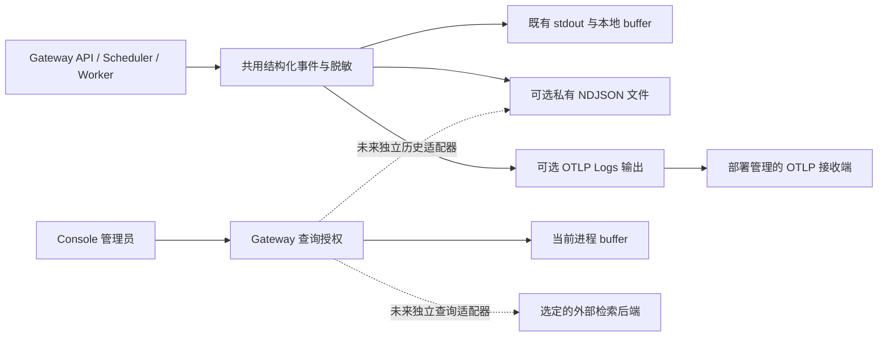

# 运行日志输出与历史查询设计

[English](runtime-log-product-design.md) | [当前日志行为](runtime-logging.zh-CN.md) | [文档索引](README.zh-CN.md)

> 状态：2026-10-01 已确认输出方向为可选的**文件与 OTLP Logs**，保留 stdout。本文区分该方向与 [#151](https://github.com/ccsert/artifact-gateway/issues/151)、[#152](https://github.com/ccsert/artifact-gateway/issues/152) 中待定的历史/查询决策。文件输出实现在 [#194](https://github.com/ccsert/artifact-gateway/pull/194)；OTLP 仍在验证。两种输出都不增加 Console 历史，也不代表跨节点/重启部署验收完成。本文不选择日志后端或采集器产品。

## 1. 当前行为与共用事件

管理员需要识别出错的 API 或 Worker 进程，追踪请求或任务，并在重启后保留证据。运行事件用于排障；审计记录仍在 PostgreSQL 中承担操作证据，具有独立的保留策略。

`internal/operationalog/logger.go` 每行输出一个脱敏 JSON 对象。共用字段为 `time`、`level`、`msg`、`instanceId`、`sessionId`、`component`、`operation`、`requestId` 和 `traceId`，请求与任务已经使用这些字段关联。三个目的地共用源事件与脱敏边界；输出器应保留结构化 group 和普通属性。输出批次不要求新增 `eventId`、来源分类、全局 sequence 或截断规则。

`cmd/gateway/main.go` 在既有 HTTP 与业务资源清理之后负责输出清理。默认 stdout 和进程内 buffer 为借用目的地，关闭输出对它们是 no-op。拥有资源的输出提供自身 flush/close 行为；重复关闭安全，一项清理错误不会跳过另一回调。

`internal/app/runtime_logs_api.go` 仍通过 `GET /api/v2/runtime/logs` 只查询内存，返回 `scope=local`、`instanceId`、`sessionId` 及进程内 `beforeSequence` 游标。仅平台管理员可查询；必须改密账号在检查 buffer 可用性之前被拒绝。buffer 禁用或请求其他实例时返回 503；重启清空 buffer。其 16 KiB 行限制仅为 buffer 接纳限制，不是所有事件的统一大小或文本截断策略。

## 2. 两种可选输出模式

两种模式默认都关闭，可以独立启用或同时启用；stdout 继续可用。PostgreSQL、RustFS、操作系统和第三方应用日志仍由部署平台负责。

| 模式 | 交付与所有权 | 对查询的影响 |
| --- | --- | --- |
| 文件 | Gateway 将相同脱敏 NDJSON 写入部署提供的可写目录，仅管理自身私有 session 文件。 | 持久卷上的已写数据在进程重启后仍存在，但 Console 尚无文件历史读取器。 |
| OTLP Logs | Gateway 通过标准协议向配置的接收端发送结构化记录；下一批采用 OTLP/HTTP protobuf，须验证有界队列、重试、退出清理和错误遮蔽。 | OTLP 是输出协议；接收端存储、保留和检索是独立能力，输出 endpoint 不是查询 endpoint。 |
| stdout/本地 buffer | 既有默认行为与 Docker/节点轮转继续。 | buffer 为每个进程的临时数据；容器轮转不提供保留的集群检索。 |

仓库不以内置 Loki、Alloy 或日志数据库作为基线。部署可使用现有接收端或可观测平台；未来 Gateway 查询适配器须先取得后端读取 API、认证、分页、保留和失败行为的证据，再做选择。写入与查询凭据分开，均由服务端配置。

## 3. 文件轮转与保留边界

文件配置与失败行为以[运行日志文档](runtime-logging.zh-CN.md)为准。可配置起点为每段 100 MiB、10 个封闭备份、封闭段 7 天期限；这些值保守且未经本部署容量测量。

每个输出器创建私有 `gateway-*` session 目录，含完整行的 `active.ndjson` 与编号封闭段。完整事件加入后将超限时先轮转，成功写入调用 Sync；部分写入回滚失败后停止写入受损段。正常退出在运行资源清理之后 flush/close。同步文件写入可能延迟调用方；Sync 不保证掉电、SIGKILL 或文件系统目录项恢复时零丢失。

数量与期限清理仅作用于本次输出实例创建的封闭段，保留其活动文件和旧 session，拒绝观察到的替换。私有目录由对应输出器独占管理，身份检查不是抵御同 UID/root 并发路径变更的文件系统事务。

配置父目录因此**没有跨重启的总大小或总期限上限**。在独立且经过验证的所有权/保留机制完成前，部署负责卷权限、容量监控及旧 session 保留。Kubernetes 的只读 nonroot 镜像需要显式可写挂载；`/tmp` 不提供持久存储。本文不配置卷或部署。

文件历史阶段须决定读取活动文件还是仅封闭段、一个来源涵盖哪些 session/节点，以及何种所有权登记允许删除旧 session。仅凭文件名 glob 不能授权接管或删除既有用户文件。

## 4. OTLP 交付与故障验证

OTLP Logs 配置须与现有 trace 输出配置分开，并保持 tracing 行为不变。endpoint、TLS 信任及可选 header 均为服务端配置；凭据和原始接收端错误不能进入日志属性、fallback 信息、查询响应或浏览器。

独立 OTLP 批次须以合成本地接收端验证协议原生时间、级别、正文、核心字段、group 和关联属性。出口接纳、接收端确认与持久存储是不同状态。队列容量、溢出行为、可重试/永久错误、部分成功及退出时限需要明确测试与文档，异步接纳不能表述为保证交付。

某个可选目的地失败时，既有 stdout/buffer 仍应可用，也不能跳过其他已配置目的地。故障报告使用独立 stderr、脱敏消息与有限报告频率，避免通过失败出口递归记录。启用的输出初始化失败在打开业务资源之前终止启动；运行交付错误不隐式改变既有退出码策略。不承诺持久重试日志或跨出口交付事务。

## 5. 历史与查询是独立契约

现有 `GET /api/v2/runtime/logs` 及管理员/改密门禁保持不变。未来文件历史或外部检索须明确标识来源与能力；失败时不能静默以当前进程内存替代历史或集群结果。

| 待决策点 | 选项与代价 |
| --- | --- |
| 文件历史来源 | 单节点部署目录历史范围较小；多节点历史需要汇集/所有权边界。两者都不能由文件输出器单独提供。 |
| 跨 session 保留 | Gateway 所有权登记可支持受控清理；部署管理保留则将删除放在 Gateway 之外。都需要保护活动读取者，并以测量明确总容量策略。 |
| 外部检索后端 | 复用有适用读取 API 的部署平台，或评估权限、分页和保留后增加特定服务端适配器。仅兼容 OTLP 不能决定选项。 |

历史游标须包含稳定的来源/session/segment/offset 身份与确定的排序裁决，不能跨重启沿用内存 buffer 的 `sequence`。须定义残尾、损坏行、被替换/缺失段、过期游标、翻页时文件被删除、读取预算及快照边界；外部分页同样需要与后端匹配的稳定排序和重复/边界处理。

实施历史 API 前先更新 OpenAPI，定义时间范围、页大小、执行时限及管理员限流。后端地址、凭据和原始查询语言留在服务端。新路由、响应字段、超时、保留承诺及跨节点行为是该契约的决策，不是本文宣称已实现的能力。

## 6. 未来 Console 体验与安全

入口仍为“系统运行 → 运行日志”，目前查询当前进程。历史适配器完成后，明确区分本地临时、已保存文件及外部/集群来源，显示各自可用时间窗与新鲜程度；查询失败后保留已加载结果并标记过期。区分加载、空结果、未配置/不可用来源、历史过期和部分结果。

采用有界的时间/级别/组件/关联过滤及不透明游标“加载更早日志”，固定查询截止时间。审计/任务链接可预填关联 ID 和较窄时间锚点；展开行与复制 JSON 使用同一份脱敏数据，普通结构化字段仍须可用。关键词与日志正文不进入共享 URL 或查询审计。批量导出、实时 tail 和告警需另做有界读取与授权设计。

每次请求都在检查来源可用性之前验证平台管理员与强制改密状态。按属性名与敏感 group 遮蔽并不能证明任意消息文本或原始 stderr 安全；未来 Console 历史读取器仅应返回规范化脱敏事件。使用合成秘密标记验证详情/复制/错误路径，不使用真实凭据或生产日志作为测试数据。

## 7. 交付与验收

1. 合入独立审查过的行/属性、敏感 group、查询权限及生命周期批次；验证每个新 head 与组合后的 main，不沿用旧 CI 绿灯。
2. 分别验证可选文件轮转/保留/错误行为和 OTLP 协议/队列/TLS/重试/退出行为，保留 stdout 与既有查询语义。
3. 决定上述历史来源、跨 session 所有权/保留和外部检索方案，再分小批次实施 OpenAPI、读取/查询适配器及 Console 能力。
4. 使用持久挂载、至少两个 API 节点和独立 Worker 做部署验收：关联请求/任务事件，重启进程后读取保留证据，执行出口中断与过期，在测量负载下核对缺口。本地合成测试与 CI 不代替该验收。

容量与性能目标须依据实际流量、平均事件字节数、峰值、磁盘容量及接收端限制确定。本文不选择固定 14 天后端策略，也不承诺集群查询延迟。#151/#152 在持久化、历史/检索及部署验收完成前保持开放；合并本文不授权部署或关闭验收。
