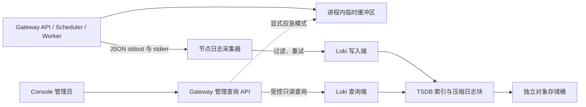

# 运行日志产品设计（提案）

[English](runtime-log-product-design.md) | [当前已实现的日志能力](runtime-logging.zh-CN.md) | [文档索引](README.zh-CN.md)

> 状态：2026-09-30 设计提案，关联 [#151](https://github.com/ccsert/artifact-gateway/issues/151) 与 [#152](https://github.com/ccsert/artifact-gateway/issues/152)。本文的集中采集、持久存储和集群查询尚未实现或部署；不能把本地预览或 CI 当作这两项 Issue 的验收。

## 1. 用户要解决的问题

平台管理员需要在一个入口回答三个问题：**哪个 Gateway API 或 Worker 节点出了问题、同一请求或任务发生了什么、重启后还能否追溯**。日志是排障材料，审计记录是操作证据，两者以 Request ID、Trace ID 或任务 ID 关联，但存储与保留策略相互独立。

本期覆盖 Gateway API、Scheduler 和 Worker 进程的应用运行事件。独立 Worker 与 API 节点使用同一查询入口。PostgreSQL、RustFS、宿主机及其他业务应用的日志不进入本期 Console；它们由部署平台自己的可观测性入口负责。Console 只向平台管理员开放。

当前代码证据：`internal/operationalog/logger.go` 写每行一个 JSON 对象；`cmd/gateway/main.go` 同时写 stdout 和可关闭的进程内缓冲区；`internal/app/runtime_logs_api.go` 只查询该缓冲区；`compose.yml` 为 Gateway 配置 Docker `json-file` 轮转。现有 `GET /api/v2/runtime/logs` 的 `scope=local`、`beforeSequence` 仅适合单进程应急查看，不能表示集群历史日志。

## 2. 产品界面与使用路径

入口继续是 **系统运行 → 运行日志**，默认展示最近 1 小时、API 与 Worker、全部级别，最新记录在前。页面分成紧凑的筛选栏、来源与采集状态行、结果列表；不放大块静态 Alert，不用页码表达无限增长的日志流。

| 用户动作 | 预期行为 |
| --- | --- |
| 从审计记录进入 | 带上 Request ID / Trace ID 与该记录时间前后 15 分钟；保留可清除的关联条件。 |
| 从任务或 Webhook 投递进入 | 以任务/投递 ID 查询 Worker 事件，并显示来源为 Worker。 |
| 普通排障 | 时间快捷项 15 分钟、1 小时、6 小时、24 小时；可按来源、节点、级别、组件、关键词组合筛选。节点从运行节点列表选择，不要求记忆实例 ID。 |
| 查看单条日志 | 首行显示毫秒时间、级别、API/Worker 来源、节点、组件和摘要；展开后显示允许展示的结构化字段、关联 ID、复制脱敏 JSON 与跳转审计记录。长消息折叠，键盘可操作。 |
| 查看更早记录 | 游标“加载更早日志”，追加结果；固定首次查询的截止时间，新日志只在“刷新”后进入列表。无下一页时不显示按钮。 |

结果状态必须区分：**尚未配置采集后端**、**采集或查询后端故障**、**正在查询**、**查询范围内确实无记录**、**超出保留期**、**采集延迟或部分缺失**。页面显示 `集群日志` 或 `当前节点临时日志` 的来源标记，以及查询截止时间、保留窗口和采集状态；不显示未经计算的“总日志数”。后端故障时保留已加载的结果并标记为旧结果，不自动改查本地缓冲区。

第一阶段支持复制单条脱敏记录与带筛选条件的页面链接。关键词不放入分享 URL；批量导出、实时 Tail、保存搜索和告警规则另行设计，避免无界读取与新的权限面。

桌面版用紧凑列表/可展开行：主筛选行只放时间快捷项与 `RangePicker`、来源、级别、关键词和“查询”；节点、组件、Request/Trace ID 放在“更多筛选”。每条结果的时间、级别、来源、节点和消息先可见，展开后再给结构化字段与复制操作。窄屏改为单列结果，不横向滚动筛选表格；时间按用户时区显示，复制的 JSON 保留 UTC。优先使用现有 Ant Design 输入与筛选组件和 Console 的游标加载组件；Alert 只承载需要行动的故障，不承载静态说明。

## 3. 日志如何切分

“切分”同时有三层含义，分别处理：

1. **逻辑分类**：稳定字段 `source=api|scheduler|worker`、`eventKind=access|task|dependency|lifecycle|system`、`level`、`component`。独立进程与单进程多角色都由**事件自身**标明来源，不仅依据 Pod 名称推断。HTTP 访问日志默认只记录 5xx 和慢请求；`GATEWAY_ACCESS_LOG=full` 是显式诊断开关，不改变审计日志。
2. **单条事件边界**：一条事件是一行 UTF-8 JSON，异常堆栈作为转义后的结构化字段，不用跨行拼接。建议单条上限 16 KiB；超出时保留关键字段、截断长文本并标记 `truncated=true`，同时计数。现有本地缓冲区会丢弃超过 16 KiB 的行，实现时必须统一行为，不能静默丢失关键错误。
3. **物理轮转与分块**：容器/节点上的日志轮转只提供短期缓冲；集中后端按流压缩分块，索引与数据按保留期删除。产品不自行发明按天拆文件、数据库分表或按请求建对象的格式。Compose 现有 `10m × 5` 是每容器应急窗口，不是 50 MiB 的集群保留承诺；Kubernetes 的节点轮转也不承担历史查询。

完整访问日志只能在带操作记录的限时诊断窗口内开启，建议最长 60 分钟后自动恢复 `limited`；现有静态环境变量尚无此保护，实施时需补上或由部署变更流程保证限时回滚。DEBUG 事件默认不开启。这样“切分”也承担日志量控制，而非仅改变页面分组。

事件契约在现有 `time`、`level`、`msg`、`instanceId`、`sessionId`、`component`、`operation`、`requestId`、`traceId` 之上增加 `schemaVersion`、`eventId`、`source`、`eventKind`、`deployment`。`eventId` 用于重试去重和游标边界；HTTP 方法、**路由模板**、状态码、耗时与 Worker 任务 ID 作为可选结构化字段。依赖失败以安全的 `errorCode`、依赖名和阶段表达，不直接输出原始错误对象。不得记录原始 URL、请求体、凭据或高风险请求头。原始 stderr 可被平台采集，但未通过解析与脱敏的行先归入受限的 `unparsed` 流，不直接返回 Console。

## 4. 采集、存储与保留



推荐首个共享后端为 **Loki + Grafana Alloy**，Gateway 只实现受控查询适配器，不让浏览器直接访问 Loki。Loki 的 TSDB 索引与压缩块可保存在对象存储，Compactor 执行保留删除；Request ID、Trace ID、`eventId`、`instanceId`、`sessionId` 不设为高基数索引标签，而保存在 JSON/结构化元数据中。初始标签仅为部署环境、服务、事件来源；级别和组件先作为结构化字段，是否提升为标签以真实查询负载决定。Loki 对高基数标签的限制、TSDB 与保留机制见[官方标签指南](https://grafana.com/docs/loki/latest/get-started/labels/)、[存储说明](https://grafana.com/docs/loki/latest/configure/storage/)和[保留说明](https://grafana.com/docs/loki/latest/operations/storage/retention/)。

如果部署平台已有集中日志系统，优先复用其采集与保留能力，但必须通过同一 Gateway 查询契约和验收；首个适配器仍以 Loki 为基线设计。仓库中未发现共享采集配置，不代表外部部署平台一定没有。

| 方案 | 取舍 |
| --- | --- |
| 复用已有平台日志系统 | 不新增存储运维，但要为 Gateway 查询契约实现适配器，并核对权限、保留和跨节点证据；若平台已有能力，优先选择。 |
| Loki + Alloy | 提供成熟的采集、压缩块、保留和时间查询；引入独立服务与容量运维，适合作为仓库可验证的首个适配器。 |
| PostgreSQL + RustFS 自建日志索引 | 表面减少服务数量，实则要自行实现高吞吐摄取、索引、分页、删除和故障恢复，还会挤占业务数据库；不作为首期方案。 |
| 当前进程内缓冲区 | 无外部依赖、适合应急；重启清空且无法跨节点，不能满足历史查询。 |

| 环境 | 建议部署 |
| --- | --- |
| 单机开发/演示 | 可选 Loki 单进程与 Alloy；Loki 使用持久卷，仅证明功能，不宣称具备生产高可用。Compose 采集 Docker 日志需评估 Docker socket 权限，不默认扩大 Gateway 容器权限。 |
| Kubernetes/生产 | 平台管理的 Alloy 节点采集器收集目标 API/Worker Pod；Loki 使用独立、受控的对象存储桶和持久 WAL/Compactor 工作目录。查询与写入使用分离的网络入口及凭据。 |
| 已有日志平台 | 平台继续负责采集与保留；Gateway 增加兼容的只读适配器，Console 不暴露供应商查询语言。 |

生产优先使用与制品字节存储**独立故障域**的日志存储，以便 RustFS 故障时仍能查日志。若评估后复用 S3 兼容集群，至少使用独立桶、容量配额、凭据与保留策略，并实测故障关联风险。运行日志不写入 Gateway 的业务 PostgreSQL 表，也不与审计记录共用保留策略。

**建议初始保留期为 14 天，按部署配置**；低于保留期的查询明确提示，默认不无限保留。Loki 必须显式启用 Compactor 保留并验证实际删除；对象存储生命周期不能早于后端保留期。等级分层保留和更长周期要在测得日志量后再定，避免把成本与删除语义藏在 UI 中。容量估算以 `每秒事件数 × 平均行字节数 × 86400 × 保留天数` 为未压缩上界起点，再以实测压缩率、峰值与副本数定容量和告警阈值；本提案不假定当前流量。

采集器保存读取位置并重试。**这不等于零丢失保证**：本地文件先轮转、采集器离线、后端限流或磁盘耗尽都可能产生缺口。Alloy 的 `loki.write` 丢弃/重试指标必须报警；其写入端 WAL 在官方文档中仍标记为实验性，不作为默认持久性承诺。验收需注入短时后端故障并核对记录数和采集缺口。[Alloy 采集与写入文档](https://grafana.com/docs/alloy/latest/reference/components/loki/loki.source.docker/)、[写入指标及 WAL 状态](https://grafana.com/docs/alloy/latest/reference/components/loki/loki.write/)。

## 5. 查询契约与分页

保留现有 `GET /api/v2/runtime/logs` 作为明确标记 `scope=local` 的应急接口；新增 `POST /api/v2/runtime/logs/search` 用于集群检索，避免在旧接口上静默改变语义或把关键词写入 URL。新增 `GET /api/v2/runtime/logs/capabilities`，返回 `configured`、可用性、保留窗口、采集延迟与支持的筛选项，不返回后端地址或凭据。

拟定的请求与响应形状如下；最终字段以实施时的 OpenAPI 为准：

```json
{
  "from": "2026-09-30T03:00:00Z",
  "to": "2026-09-30T04:00:00Z",
  "sources": ["api", "worker"],
  "requestId": "req-123",
  "limit": 50
}
```

```json
{
  "scope": "cluster",
  "asOf": "2026-09-30T04:00:00Z",
  "items": [{
    "eventId": "evt-123",
    "time": "2026-09-30T03:12:00Z",
    "level": "ERROR",
    "source": "worker",
    "instanceId": "worker-01",
    "message": "task failed",
    "requestId": "req-123"
  }],
  "nextCursor": null,
  "hasMore": false,
  "partial": false,
  "collection": {
    "state": "healthy",
    "lastHeartbeatAt": "2026-09-30T03:59:30Z"
  }
}
```

集群查询请求包括 `from`、`to`、`sources`、`levels`、`instanceIds`、`components`、`requestId`、`traceId`、`keyword`、`limit` 和 `cursor`。默认 1 小时、50 条；单页上限 100；**每次查询最多 24 小时**且不得超过已配置保留期；服务端超时建议 5 秒，并配置管理员级限流。管理员可在 14 天保留窗口中选择任意一天，审计/任务入口优先给出精确时间。跨整个保留期的无时间 ID 搜索不是首期承诺：Loki 的高基数字段不作索引，查询可能扫描大量日志块；只有容量测试证明可接受，才增加分段搜索。前端只发送业务筛选条件，Gateway 以白名单构造查询，拒绝原始 LogQL、正则和自定义标签选择器。Loki `query_range` 提供时间边界、倒序和结果上限；最终执行限制仍由 Gateway 控制。[Loki 查询 API](https://grafana.com/docs/enterprise-logs/latest/reference/loki-http-api/)、[查询加速限制](https://grafana.com/docs/loki/latest/query/query_acceleration/)。

响应为统一脱敏事件列表、`scope=cluster`、固定查询截止时间 `asOf`、`nextCursor`、`hasMore`、采集状态和 `partial` 标记。游标是不透明、签名且有短期有效期的值，绑定筛选条件与 `asOf`；不使用页码或本进程 `sequence`。按时间倒序；同时间戳用 `eventId` 去重并处理边界重叠。若后端结果上限使边界无法完整取回，返回明确的 `partial` 与“缩小时间范围”提示，不能悄悄跳过记录。刷新开启新的查询窗口，已加载结果不与新窗口混排。

错误语义：未配置 `503 log_backend_not_configured`；后端不可用 `503 log_backend_unavailable`；超时 `504 log_query_timeout`；范围或筛选非法 `400`；权限不足 `403`；限流 `429`。无记录是 `200 items=[]`，与任何故障状态分开。故障时不自动降级为 `scope=local`，管理员可**显式**切换“当前节点临时日志”。

## 6. 安全、隐私与运维可见性

- 平台管理员权限在 Gateway 每次查询时检查；服务端固定后端地址、校验 TLS，写入与查询凭据分离并由 Secret 提供。Loki 不直接对浏览器或公共网络开放。Loki 的原生 HTTP API 不提供授权层，部署时必须另加网络与认证边界。[官方 API 说明](https://grafana.com/docs/enterprise-logs/latest/reference/loki-http-api/)。
- 源头字段白名单与脱敏为主，采集管道和查询响应再作防御性遮蔽。现有 `redactAttribute` 按**属性名**遮蔽，不能据此证明任意 `msg` 文本安全；实现前增加带真实形态的 token、Cookie、URL 查询串、错误文本和任务参数的金丝雀测试。复制内容与详情使用同一脱敏结果。
- 查询行为自身写入审计：操作者、时间窗、来源、关联 ID、返回条数和结果状态；不记录原始关键词、后端凭据或日志正文。审计查询不应再产生无界的访问日志循环。
- 采集器与后端必须暴露读取位置、发送失败/丢弃量、写入拒绝、存储使用率、查询延迟、保留执行与**每个预期节点的最近心跳**。每个运行进程定期发出无敏感信息的心跳事件；无流量时也能判断“真空结果”与“采集断流”。页面对采集延迟或缺失给出状态，而不是显示一个看似可信的空列表。
- 删除与备份策略覆盖独立日志桶、后端索引/WAL 和任何快照；运行日志按配置过期，审计记录按审计策略保留。对象存储版本控制或备份不能暗中延长已承诺的日志保留期。

## 7. 分阶段交付和验收

1. **#151：生产者与采集**。补齐 `eventId/source/eventKind`、安全截断和脱敏测试；在 Compose 与 Kubernetes 验证 API/Worker stdout/stderr 采集、位置恢复、独立存储、保留删除、后端短时故障与采集缺口指标。先用真实日志量做容量基线。
2. **#152：查询与体验**。定义 OpenAPI 后实现集群只读适配器、能力状态、游标、权限/限流/超时；Console 实现来源标记、筛选、详情、关联跳转、明确空/故障/超期状态和显式本地应急模式。
3. **部署验收**。至少两个 API 节点和一个独立 Worker；分别写入可识别的请求与任务事件，跨节点查询并在 API/Worker Pod 重启后读回；验证 403/429/503/504、金丝雀不泄露、同时间戳分页不漏不重、14 天保留配置与删除、采集器故障恢复。CI 与单机 Compose 通过不能替代此项。

建议把以下指标作为首轮压测目标，再按真实流量和预算调整：有时间与来源条件的最近 1 小时查询 P95 不超过 3 秒且受 5 秒服务端硬超时约束；正常采集延迟 P95 不超过 60 秒，预期节点超过 5 分钟无心跳时在页面和监控中告警；按基线流量中断采集后端 5 分钟再恢复，逐条对账并证明无静默丢弃；过期数据在保留期结束后 24 小时内由保留任务删除并验证对象存储占用回落。这些是**验收目标**，不是当前性能或持久性声明。

上线顺序为：先旁路采集并比对 stdout → 在受控环境开放集群查询 → 切换 Console 默认到集群入口 → 完成多节点/重启验收后再关闭 #151/#152。回滚只需关闭集群查询入口并保留原始 stdout 与显式本地应急接口；不删除既有审计数据。

## 8. 需要用实测确认的参数

14 天默认保留、16 KiB 单条上限、5 秒查询超时与每次最多 24 小时的查询窗口是**提案默认值**，不是已经部署的配置。实施前核对是否已有平台日志系统、日均/峰值日志量、对象存储独立故障域、期望保留期与成本预算；据实测调整，不改变 API/Console 的产品语义。
